# 现代 JVM 使用的 GC

这篇文章讲生产中最常见的三个收集器——Parallel、G1、ZGC；为了完整性补充了Shenandoah、Serial 。读完它应该能回答:当前 JDK 在跑哪个
GC、为什么是它、能做那些有意义的调整、什么时候要主动换、换之前要先测量什么。

## TL;DR

| 问题                | 短答案                                                                           |
|-------------------|-------------------------------------------------------------------------------|
| 现代 JDK 默认 GC 是哪个  | G1(JDK 9 起,JEP 248)                                                           |
| 什么情况保持默认          | 没有 p99 / p999 延迟目标,或 GC 不是当前主要瓶颈                                              |
| 什么时候评估 ZGC        | 有明确低延迟 SLA,GC pause 是主要来源,heap/CPU headroom 足够                                |
| 什么时候评估 Shenandoah | 已经在用 Temurin / Corretto / RHEL OpenJDK 等发行版,想试 ZGC 以外的低延迟路线                   |
| 什么时候评估 Parallel   | 离线、批处理、构建,只关心总完成时间                                                            |
| 第一步该做什么           | **不改 flag**,先开 GC log + JFR,确认分配速率、live set、promotion、humongous、reference、CPU |
| 容器里最大坑            | `-Xmx` ≠ K8s memory limit;后者必须留出 metaspace / direct buffer / GC 自身开销          |

## 核心结论

- Parallel 是吞吐优先的 stop-the-world 分代收集器。它适合批处理、离线任务、构建任务、吞吐优先且能接受较长暂停的系统。
- G1 是现代 HotSpot 的平衡型默认选择。它不是最低延迟收集器,而是在"较短、较均匀的暂停"和"较高吞吐"之间做默认折中。JDK 26 的
  JEP 522 让它的纯吞吐短板进一步缩小。
- ZGC 是低延迟优先的并发、移动、分代收集器。JDK 21 引入分代设计;JDK 23 让 `-XX:+UseZGC` 默认选择分代模式;JDK 24 移除非分代实现,因此
  JDK 24+ 的 ZGC 就是分代的 ZGC。
- Shenandoah 是 Red Hat 主导的低延迟并发收集器,设计目标和 ZGC 接近(pause 不随堆增长),但 barrier 模型和发行版支持不同。Oracle
  JDK 不带它。
- GC 调优的第一原则不是先改一堆 flag,而是先用 GC log + JFR 确认原因:分配速率、live set、晋升、humongous object、reference
  processing、metaspace、native/JNI pinning、CPU/内存 headroom。现在的 JVM 默认参数并没有那么不堪,只有在你很清楚你需要什么的时候才需要去修改它。

## 版本边界

| JDK 版本    | 默认/状态变化                                                              | 对生产选择的含义                                     |
|-----------|----------------------------------------------------------------------|----------------------------------------------|
| JDK 8     | Parallel 常见默认;G1 已可用但还不是默认                                           | 旧系统迁移时常遇到 Parallel 参数包袱                      |
| JDK 8u191 | 容器感知默认开启(`UseContainerSupport`)                                      | 8u191 之前在容器里 heap ergonomics 经常出错,要么升级,要么显式配 |
| JDK 9     | JEP 248:G1 成为 32/64-bit server 配置默认 GC                               | 默认策略从吞吐优先转向延迟/吞吐平衡                           |
| JDK 11    | JEP 333:ZGC 作为 experimental 引入;JEP 189:Shenandoah 进入上游(实验)           | 低延迟路线进入主线 JDK,但当时还需 experimental unlock      |
| JDK 12    | JEP 346:G1 主动归还 unused committed memory                              | 容器 footprint 改善                              |
| JDK 15    | JEP 377:ZGC 变成 product feature;JEP 379:Shenandoah 变成 product feature | 两者都不再需要 experimental unlock                  |
| JDK 16    | JEP 387:Elastic Metaspace                                            | Metaspace 回收和 footprint 改善                   |
| JDK 21    | JEP 439:Generational ZGC 引入(实验性可选)                                   | ZGC 开始利用"多数对象朝生夕死"的分代假设                      |
| JDK 23    | JEP 474:`-XX:+UseZGC` 默认 generational mode                           | 选择 ZGC 时,默认就是 Generational ZGC               |
| JDK 24    | JEP 490:移除 non-generational ZGC mode                                 | `ZGenerational` 不再是有效调优分支                    |
| JDK 25    | G1 RSet memory、mixed GC candidate selection 改进;JEP 523 仍未 delivered  | 大堆 G1 native memory 和 mixed GC 长尾改善          |
| JDK 26    | JEP 522:G1 通过减少同步提升吞吐                                                | G1 与 Parallel 的纯吞吐差距继续缩小,但仍不是吞吐专用收集器         |

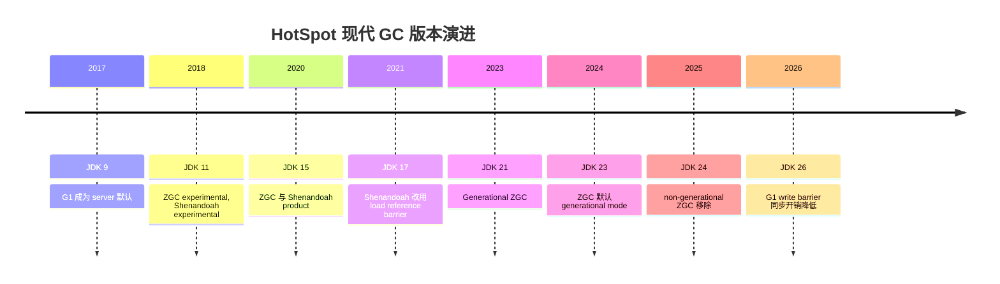

## 选择策略

| 目标                                                | 首选候选            | 为什么                                         | 限制                                                   |
|---------------------------------------------------|-----------------|---------------------------------------------|------------------------------------------------------|
| 默认 Java 服务,不确定具体瓶颈                                | G1              | JDK 默认,延迟/吞吐折中,服务化场景成熟,启动开销比 ZGC 更低         | 不是最低延迟;write barrier、remembered set、并发标记有额外 CPU/内存成本 |
| 批处理、离线计算、构建、吞吐优先                                  | Parallel        | 并行 STW,调优模型简单,追求总体完成时间                      | old/full GC 可能长暂停,用户请求型服务要小心                         |
| p99/p999 延迟敏感,大堆,暂停必须很低                           | ZGC             | 大部分延迟敏感性工作并发执行,pause 通常不随堆/live set 线性增长    | 需要足够 CPU 和 heap headroom;吞吐可能低于 G1/Parallel          |
| 同上,但用的是 Temurin/Corretto/RHEL 等 Oracle JDK 之外的发行版 | Shenandoah      | 设计目标与 ZGC 接近,在某些 workload / barrier 模式下表现更好 | 发行版依赖;团队学习成本;不同发行版可能有滞后                              |
| 内存很小、启动/footprint 极敏感                             | Serial 或验证后的 G1 | Serial 开销低,无并发结构;G1 近年改善很多                  | JEP 523 尚未 delivered,小环境默认可能仍是 Serial                |
| 需要测量"如果没有 GC 会怎样"                                 | Epsilon         | no-op memory manager,只分配不回收,用于性能隔离测试        | 必须保证堆能容纳整个 workload;实验特性                             |

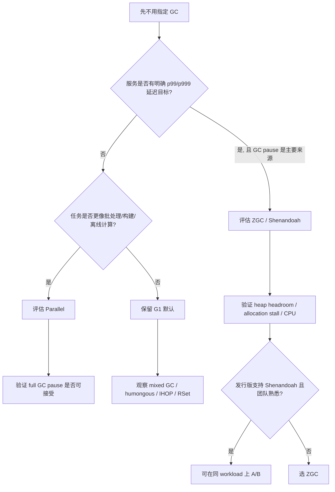

## 容器与 Kubernetes 部署

这是 2026 年生产部署最常见的形态,但前面几个版本的版本边界/默认参数表都没专门讲。补在这里。

### 容器感知

| 项                              | 默认 / 语义                 | 备注                                        |
|--------------------------------|-------------------------|-------------------------------------------|
| `-XX:+UseContainerSupport`     | 默认 true(JDK 10+,8u191+) | 容器里 JVM 会按 cgroup 限制而不是宿主机物理内存算 heap      |
| cgroup v1 / v2                 | JDK 15+ 大幅改进 v2 检测      | 老版本(8u191 ~ 13)在 cgroup v2 下可能误判,务必升级或显式配 |
| `-XX:InitialRAMPercentage=<p>` | 默认 1.25%                | 替代 `-Xms` 的百分比版本,推荐显式设                    |
| `-XX:MaxRAMPercentage=<p>`     | 默认 25%                  | 容器里默认 1/4 太保守;常见生产设置 70-80%               |
| `-XX:MinRAMPercentage=<p>`     | 默认 50%                  | 小容器(< ~250MB)时的最大比例                       |

### K8s memory limit 和 `-Xmx` 的关系

K8s memory limit 必须 > `-Xmx` + 其他开销

JVM 的总内存(RSS)不只 `-Xmx`。还要算:

- Metaspace(默认无上限,需要 `-XX:MaxMetaspaceSize`)
- Code cache(`-XX:ReservedCodeCacheSize`,默认 240MB)
- 每线程栈(`-Xss`,默认 1MB × 线程数)
- Direct buffer(NIO,`ByteBuffer.allocateDirect` 默认与 `-Xmx` 同上限)
- GC 自身结构(card table、RSet、bitmap、page table;ZGC 还有额外虚拟内存)
- JNI / native 内存(JVM 看不到,GC 也管不到)

经验:`-Xmx` 设为容器 memory limit 的 **70-80%**,剩下留给上面这些。否则会被 Linux OOMKilled,而且不会先触发 JVM 的
OutOfMemoryError。

K8s 里 OOMKilled 和 JVM 的 OutOfMemoryError 是两件事:

- OOMKilled:Linux kernel 看到 RSS 超过 cgroup limit,直接杀进程。应用栈里看到的是 `137` 退出码,没有任何 Java 异常。
- OutOfMemoryError:JVM 自己在 Java heap 耗尽前抛。GC 会努力过,GC log 里能看到 full GC / allocation stall 前兆。

监控 RSS 而不是只盯 `-Xmx` 用量,是容器里 GC 调优的前提。

### CPU throttling 放大 STW pause

CFS bandwidth control(`cpu.limits`)按 period(默认 100ms)分配 quota。一个 200ms 的 STW pause 在 CPU limit = 2
的容器里,实际上会变成 ~400ms wall clock——因为 GC worker 跑到一半 quota 用完,被 throttle 到下个 period 才继续。

后果:p99 / p999 看起来比 `-XX:+PrintFlagsFinal` 预测的 STW 还差,但 GC log 里看到的 GC pause 反而正常。这种"GC
看起来正常但延迟变长"的现象,实际在 CPU 调度,不在 GC。

经验:

- latency-sensitive 服务优先用 CPU request ≈ limit(避免 throttle),而不是 request < limit 省成本。
- 或者用 `cpu.requests` 保证下限,放弃 limit(Guaranteed / Burstable QoS 的取舍)。

### ZGC + K8s 的几个坑

- `ZUncommit` 默认开启,空闲的 committed memory 会被还给 OS。K8s 看到 RSS 下降,调度器可能在这个节点上再塞 pod，一旦 JVM 重新
  commit,触发挤压。
- `-XX:+AlwaysPreTouch` 启动时把整个 `-Xmx` 摸一遍,K8s 里立刻看到 RSS 涨到上限,可能影响 startup probe 节奏。
- ZGC 在 JDK 15 之前的多映射(multi-mapping)模式占用 3x 虚拟地址，JDK 15+ 已改为单映射,但 page table 仍比 G1 重。在容器里
  page table 不是 RSS 的主要部分,但在大堆场景要注意。
- large pages 配置在 K8s 里需要节点级 `sysctl`,多数 managed K8s 默认不开。

### 实操建议

1. 显式设 `-XX:MaxRAMPercentage=75.0 -XX:InitialRAMPercentage=75.0`(或 `MinRAMPercentage`,看容器大小),不要依赖默认 25%。
2. 设 `-XX:MaxMetaspaceSize`(典型 256MB-512MB),防止 class leak 把整个容器撑爆。
3. `jcmd <pid> VM.native_memory summary`（需要 `-XX:NativeMemoryTracking=summary`
   ）是容器里排查“内存不知道去哪了”的标准动作，详见 [JVM 内存视角：Java heap 之外](#jvm-内存视角-java-heap-之外)。
4. 把 GC log 写到 stdout 让 K8s 收集,而不是 `/tmp` —— pod 重启就丢。

## 参考数据

下面三组数据分别来自:2018 年 JDK 11 实验性 ZGC 的 SPECjbb、2024 年 M1 MacBook Pro(ARM)上的 Mill Build 粗基准、Thomas
Schatzl 引用的 G1 改进数据。

它们的价值是揭示**设计取舍方向**,不是给出"在我的 workload 上 ZGC 一定比 G1 快多少"。GC 表现强依赖 workload 分配形态、heap
headroom、live set、对象寿命分布、硬件平台(x86 vs ARM)、发行版。

任何要写进自己 SLA 的数字,必须用**自己的 workload、自己的硬件、自己的 JDK 版本**重测一次,并通过 JMH 或类似框架做可信对比。

### ZGC JEP 333 的历史基准

历史基准,不代表当前生产 ZGC 表现

JEP 333 的数据展示的是 2018 年 JDK 11 实验性 ZGC 的设计目标:"用吞吐代价换极低暂停"。Generational ZGC(JDK 21+)和 JDK 25/26
的 ZGC 已经不是这个表现。引用这组数据时必须标明历史性。

JEP 333 在 JDK 11 引入 experimental ZGC 时给了一个 SPECjbb 2015、128G heap 的示例数据:

| Collector | max-jOPS | critical-jOPS | avg pause  | p99 pause  | max pause  |
|-----------|----------|---------------|------------|------------|------------|
| ZGC       | 100%     | 76.1%         | 1.091 ms   | 1.512 ms   | 1.681 ms   |
| G1        | 91.2%    | 54.7%         | 156.806 ms | 428.095 ms | 543.846 ms |

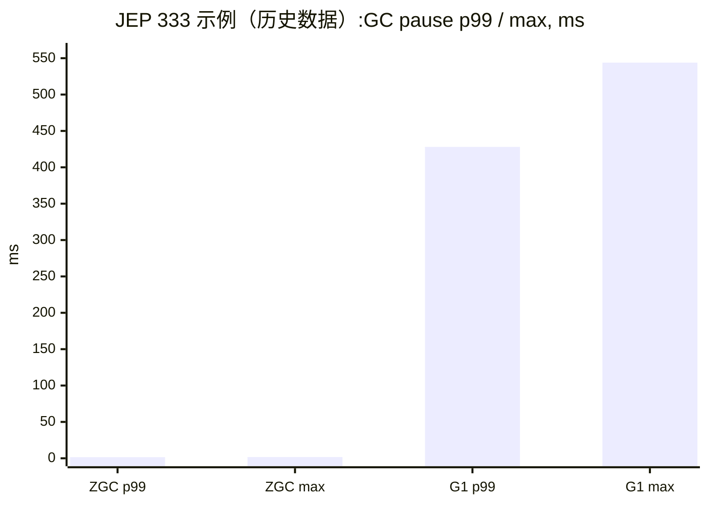

### Mill Build 博客的 Java 23 简单测试

ARM 平台 测试结果,外推到生产 x86 服务器要保留怀疑

Mill Build 博客的实验跑在 M1 MacBook Pro(ARM aarch64)上。ARM 和 x86 server 在 write barrier 指令数、cache line 行为、TLB
上有差异,ZGC 的 colored pointer 在 aarch64 上的代价也和 x86_64 不完全一样。这些数据**不能直接当成 x86 生产的预测值**
,只能定性参考"headroom 对 ZGC 影响很大"这个结论。

Mill Build 博客用一个分配/live-set 实验做了 G1 / ZGC 对照。作者也明确说这是 rough benchmark,但数据对理解 GC 取舍很直观:

- 在 generational workload 中,G1 pause 从随机 long-lived 场景的 10s/100s/1000s ms 量级降到 1s/10s ms 量级,吞吐约 3.2-7.8
  GB/s。
- ZGC 在 heap 只有 live set 约 2 倍时表现并不神奇:pause 可到 10s/100s ms,吞吐约 2.3-2.6 GB/s;当 heap 到 live set 4
  倍以上,pause 常降到 1-10 ms。

| 场景            | live set | heap     | G1 pause | G1 throughput | ZGC pause | ZGC throughput |
|---------------|----------|----------|----------|---------------|-----------|----------------|
| headroom 约 2x | 400 MB   | 800 MB   | 4 ms     | 7218 MB/s     | 39 ms     | 2428 MB/s      |
| headroom 约 4x | 400 MB   | 1600 MB  | 3 ms     | 7495 MB/s     | 12 ms     | 4130 MB/s      |
| headroom 约 8x | 400 MB   | 3200 MB  | 2 ms     | 7536 MB/s     | 1 ms      | 5139 MB/s      |
| headroom 约 2x | 1600 MB  | 3200 MB  | 5 ms     | 7563 MB/s     | 208 ms    | 2383 MB/s      |
| headroom 约 4x | 1600 MB  | 6400 MB  | 10 ms    | 7464 MB/s     | 9 ms      | 3513 MB/s      |
| headroom 约 8x | 1600 MB  | 12800 MB | 4 ms     | 7830 MB/s     | 1 ms      | 4088 MB/s      |

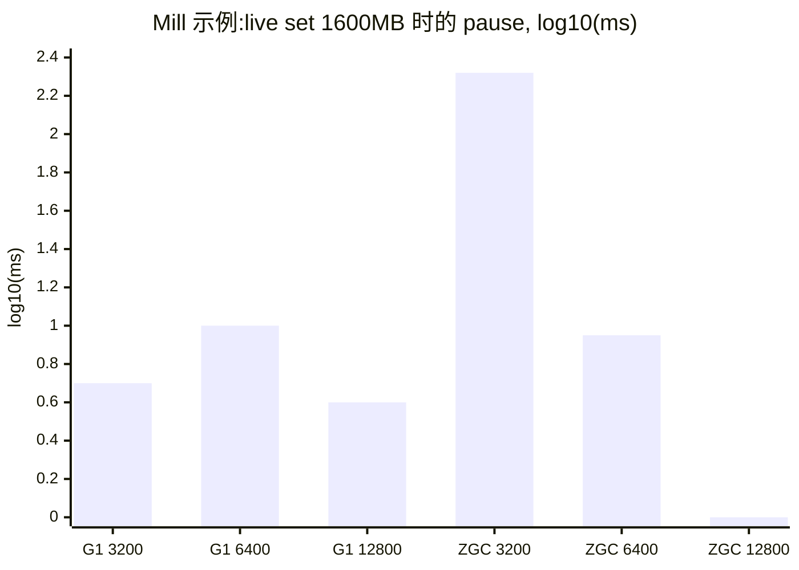

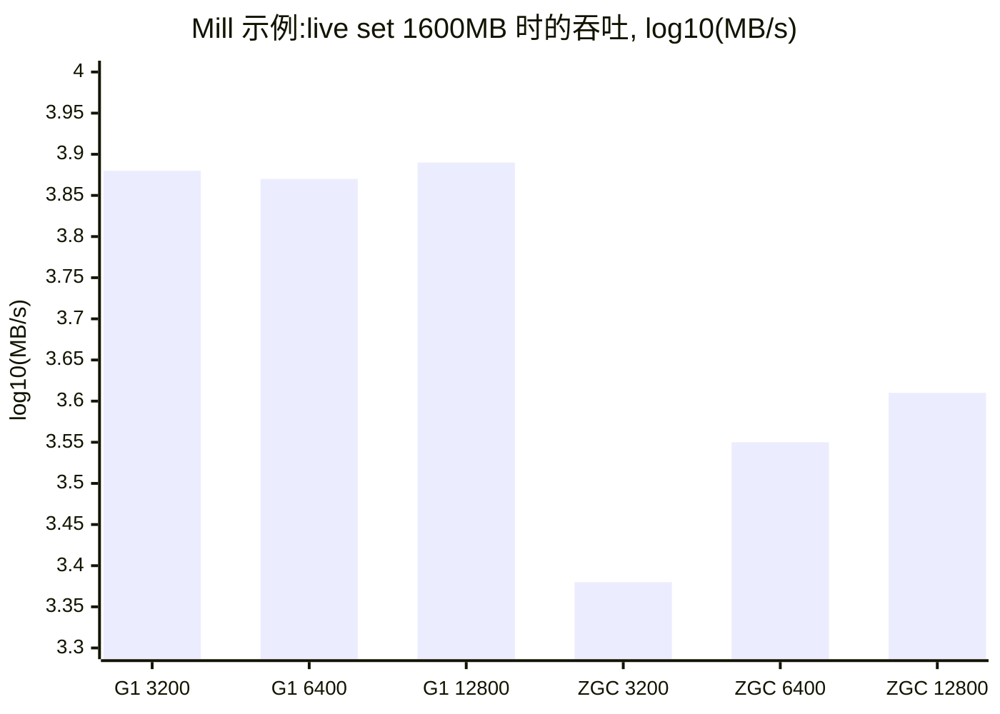

这里的 Mermaid 图是 log10 转换后的近似图,不是渲染器原生 log axis;精确原始值以上方表格为准。

### G1 近年变化的工程数据

Thomas Schatzl 的 OpenJDK GC 文章给了几个很实用的数字:

- JDK 25 的 G1 remembered set 合并优化,在一个 heavy remembered-set benchmark 中,64 GB Java heap 下相关 native memory
  峰值从约 2 GB 降到约 0.75 GB。
- JDK 25 的 mixed collection candidate selection 改进,用 incoming reference count 估算 remembered set 成本,示例图中消除了最高约
  400 ms 的末尾 mixed GC pause spike。
- JDK 26 的 JEP 522 通过双 card table 减少 G1 write barrier 同步:重引用字段写入场景观察到 5-15% throughput gain;x64
  write barrier 从约 50 条指令降到约 12 条,非重引用写场景也观察到最高 5% throughput gain;第二张 card table 约增加 0.2%
  Java heap capacity 的 native memory,也就是每 1 GB heap 约 2 MB。

| 变化                          | 数据                            | 对调优的含义                               |
|-----------------------------|-------------------------------|--------------------------------------|
| JDK 25 RSet memory 改进       | 2 GB -> 0.75 GB peak          | 大堆 G1 native memory 压力下降,但仍要关注 RSet  |
| JDK 25 mixed pause spike 改进 | up to 400 ms spike eliminated | mixed GC 末尾长尾改善,但不是所有 workload 都自动消失 |
| JDK 26 G1 write barrier     | 50 -> 12 x64 instructions     | G1 纯吞吐短板缩小                           |
| JDK 26 throughput gain      | 5-15%, 特定重引用写入场景              | G1 更适合作为默认,但 Parallel 仍有吞吐专用价值       |
| JDK 26 extra card table     | 0.2% heap, 2 MB / 1 GB heap   | 用少量 native memory 换同步开销下降            |

## Parallel

Parallel GC 也叫 throughput collector。它是分代收集器,新生代和老年代都用多个 GC worker 以 stop-the-world
方式并行回收;启用参数是:

```bash
java -XX:+UseParallelGC ...
```

### 默认设置

| 参数                           | 默认/语义                                                                | 备注                                                                    |
|------------------------------|----------------------------------------------------------------------|-----------------------------------------------------------------------|
| `-XX:+UseParallelGC`         | 手动启用 Parallel                                                        | 使用后 minor 和 major collection 默认都并行                                    |
| `-XX:ParallelGCThreads=<N>`  | 默认公式:`ncpus ≤ 8` 取全部,超过按 `8 + (ncpus-8)*5/8`(G1 / ZGC 共用此 heuristic) | 线程数过多会增加 task queue stealing、PLAB 碎片、终止屏障开销,反而拖长 pause                |
| `-XX:MaxGCPauseMillis=<N>`   | 默认无 pause-time goal                                                  | 只是 hint;为了缩短暂停可能牺牲吞吐                                                  |
| `-XX:GCTimeRatio=99`         | 默认 GC 时间目标约 1%                                                       | 公式是 `1 / (1 + N)`                                                     |
| `-XX:+UseAdaptiveSizePolicy` | 默认自适应                                                                | 依据 pause、throughput、footprint 目标调 generation size                     |
| `-XX:+UseNUMA`               | 默认关闭                                                                 | 大多 socket 机器上可启用,让 heap 按 NUMA node 分配,减少跨 node 访问;但不是所有 workload 都受益 |
| 默认最大 heap                    | 常见规则:物理内存 1/4                                                        | 容器/发行版/版本会影响,必须用 `PrintFlagsFinal` 验证                                 |
| 默认初始 heap                    | 常见规则:物理内存 1/64                                                       | 生产常将 `-Xms` 与 `-Xmx` 设同值换可预测性                                         |

### 回收流程

Parallel 的基本流程更接近传统分代模型:

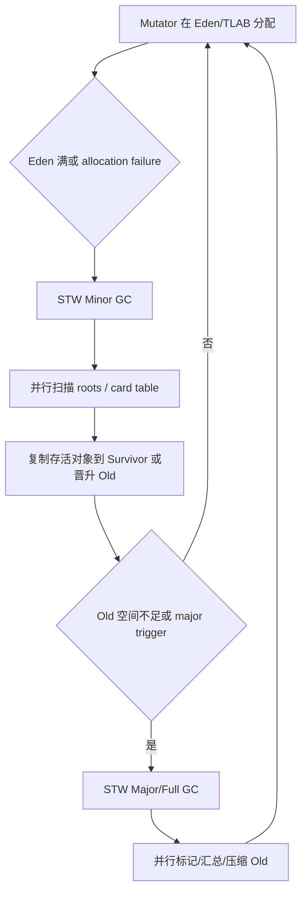

Parallel 的强项是 GC 线程集中抢占 CPU,用较少的并发协调换总体吞吐。它的弱项也很直接:一旦 old/full GC,用户线程停顿可能随
live set 和 heap 规模变长。

### 适用场景

- 批处理、ETL、离线计算、构建系统、测试执行器。
- 对总体完成时间敏感,但对单次暂停不敏感。
- heap 不大,或者 full GC 暂停可接受。
- 机器 CPU 足够,GC worker 并行能带来收益。

### 调优方向

1. 先定 heap:`-Xms = -Xmx` 可以减少运行期扩缩容噪声;如果不确定,先保留自适应,再用日志观察。
2. 以吞吐为主:放宽 `MaxGCPauseMillis` 或不设,让 `GCTimeRatio` / 自适应策略主导。
3. 如果 pause 过长:降低 young gen 或限制 `ParallelGCThreads` 可能缩短单次停顿,但可能增加 GC 频率。
4. 如果出现 `GC overhead limit exceeded`:这不是"GC flag 问题",通常是 heap 太小、live set 太大、泄漏或对象生命周期设计问题。Parallel
   默认会在 GC 时间超过 98% 且回收低于 2% 时抛出 OOM。
5. JNI/GCLocker 场景要关注 JDK 25 之后的修复;旧版本可能遇到 GCLocker 导致的异常停机或退化。详见 [G1](#G1) 节里对
   GCLocker / JNI pinning 的讨论,机制是一样的。

## G1

G1 是 generational、incremental、parallel、mostly concurrent、STW、evacuating collector。它把 heap 切成等大的 region;每个
region 当前可作为 Eden、Survivor、Old、Humongous 或 Free。G1 的名字来自 garbage-first:优先选择"回收收益高、复制成本低"的
region。

```bash
java -XX:+UseG1GC ... 
```

### 默认设置

| 参数                                   | 默认                                  | 含义                                                |
|--------------------------------------|-------------------------------------|---------------------------------------------------|
| `-XX:MaxGCPauseMillis`               | 200 ms                              | 最大暂停目标,soft goal                                  |
| `-XX:ParallelGCThreads`              |                                     | STW pause 内并行 worker 数;HotSpot 默认公式见下方注           |
| `-XX:ConcGCThreads`                  | `(ParallelGCThreads + 3) / 4`(向上取整) | concurrent marking worker 数                       |
| `-XX:+G1UseAdaptiveIHOP`             | enabled                             | 自适应决定何时开始 old marking                             |
| `-XX:InitiatingHeapOccupancyPercent` | 45                                  | adaptive IHOP 观察不足时的初始 old occupancy 阈值           |
| `-XX:G1HeapRegionSize`               | ergonomic                           | 目标约 2048 个 region;JDK 25 文档有效范围 1-512 MB,必须是 2 的幂 |
| `-XX:G1NewSizePercent`               | 5                                   | young generation 下限,占当前 heap 百分比                  |
| `-XX:G1MaxNewSizePercent`            | 60                                  | young generation 上限                               |
| `-XX:G1ReservePercent`               | 10                                  | 预留 buffer,降低 evacuation failure 风险                |
| `-XX:G1MixedGCCountTarget`           | 8                                   | space-reclamation phase 期望 mixed GC 次数            |
| `-XX:G1MixedGCLiveThresholdPercent`  | 85                                  | old region live 占比超过此值通常不进入 mixed collection      |
| `-XX:G1HeapWastePercent`             | 5                                   | 可容忍未回收空间比例,影响 mixed phase 结束                      |

ParallelGCThreads 默认公式

HotSpot 的默认值不是简单的"用全部 CPU",也不是固定的 5/8:

```
if (ncpus <= 8)  ParallelGCThreads = ncpus
else             ParallelGCThreads = 8 + (ncpus - 8) * 5 / 8
```

前面 8 个 CPU 全用,超过 8 的部分按 5/8(62.5%)递增。换算到常见机器:

| ncpus | 默认 ParallelGCThreads | 实际占比 |
|-------|----------------------|------|
| 4     | 4                    | 100% |
| 8     | 8                    | 100% |
| 16    | 13                   | 81%  |
| 32    | 23                   | 72%  |
| 64    | 43                   | 67%  |
| 128   | 83                   | 65%  |

ncpus 指的是**容器感知的可用 CPU 数**(`-XX:+UseContainerSupport`,JDK 10+ 默认开),取 cgroup limit /
`active_processor_count`;K8s 里就是 `resources.limits.cpu`(向下取整)。

这个 5/8 参数 的设计动机是:**worker 越多,GC 内部同步(task queue stealing、PLAB 分配、终止屏障)开销越大**,收益边际递减;留出
CPU 给 mutator 和 concurrent worker 也更稳定。所以即使在大机器上手动设成 ncpus 全用,往往 pause 反而更长。

### 回收流程

G1 高层循环是 Young-Only phase 与 Space-Reclamation phase 的交替:

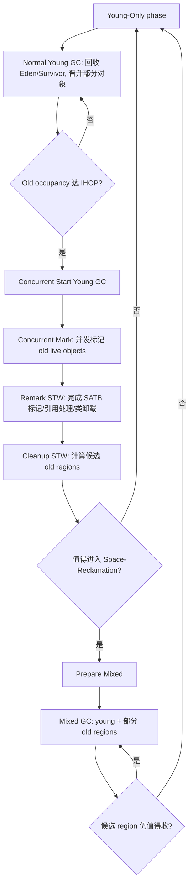

一次 G1 evacuation pause 内部通常包括:

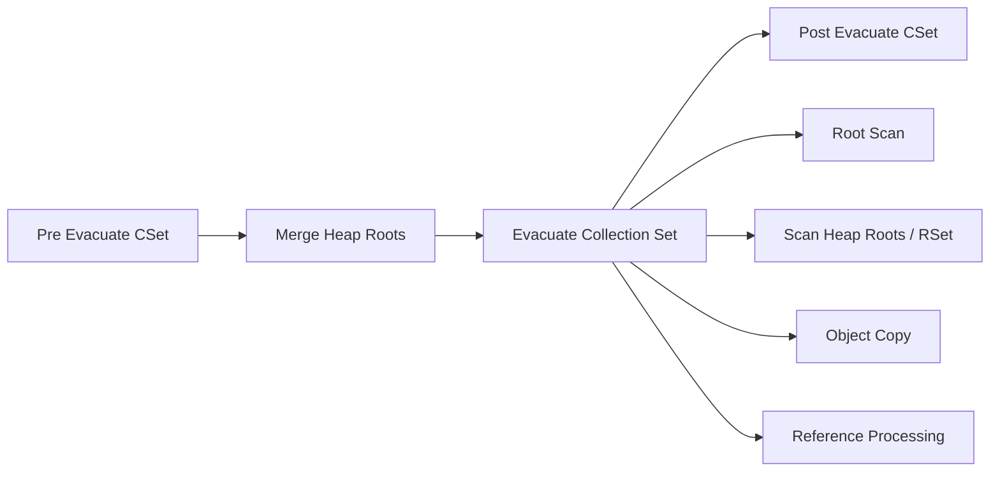

### G1 为什么能缩短 old collection pause

Parallel old collection 倾向于把 old generation 作为整体处理。G1 不把 old generation 看成一个连续大块,而是把它切成
region,并用 remembered set / card table 追踪跨 region 引用。这样 Mixed GC 可以只选一部分 old regions 和 young regions 一起
evacuation。

代价是:

- 每次引用字段写入要执行 write barrier。
- G1 要维护 card table、remembered set、SATB marking bitmap 等结构。
- 并发标记和 refinement 会与应用线程争用 CPU。
- humongous object、JNI pinned object、reference processing 仍能制造长尾。

### GCLocker / JNI pinning

JNI critical region(`GetPrimitiveArrayCritical` / `GetStringCritical`)会把 Java 对象 pin 住,这期间 GC 不能移动这些对象。这就是
GCLocker 机制。

- 如果一个 young GC 想做 evacuation,但发现某些 region 里有 pinned 对象,要么跳过该 region(空间回收打折扣),要么等 critical
  region 退出。
- 极端情况:mutator 在 critical region 里又触发 allocation failure,而 GC 又被 GCLocker 卡住,会出现退化路径(2-step
  safepoint cleanup)甚至卡死一段时间。
- JDK 21 / 22 / 25 一系列 GCLocker 改进缓解了这个问题;老版本(尤其 JDK 17 之前)需要小心 JNI 重的工作负载。
- 排查:看 GC log 里是否有 `GCLocker initiated GC` 字样,或 JFR 里 JNI 相关事件。

### 典型问题与调优方向

| 症状                                  | 先看什么                                             | 调优方向                                                                                           |
|-------------------------------------|--------------------------------------------------|------------------------------------------------------------------------------------------------|
| `Pause Full (G1 Compaction Pause)`  | GC log 里 Full GC 前是否有 `Evacuation Failure`       | 增大 heap;降低 old allocation rate;让 marking 更早开始;调 `G1ReservePercent` / IHOP;减少 humongous objects |
| mixed GC 后段突然变长                     | `gc+ergo+cset=debug`、old region predicted time   | 升级 JDK 25+;提高 `G1MixedGCCountTarget`;调高 `G1HeapWastePercent` 让 G1 更早停止收益差的 old region          |
| young GC 停顿过长                       | `Object Copy`、young live data、survivor/promotion | 降低 `G1MaxNewSizePercent` 或 `G1NewSizePercent`,但不要固定 young size 破坏 pause control                |
| humongous object 频繁触发 GC            | `Humongous regions: X->Y`、对象分配栈                  | 减少大数组 / 大 buffer;增加 `G1HeapRegionSize` 让对象不再超过半个 region;增加 heap                                |
| reference processing 长              | `Reference Processing` phase、软 / 弱 / 虚引用数量       | 减少 reference-heavy cache;调 `ReferencesPerThread`;确认是否真的需要大量 `SoftReference`                    |
| real time 远大于 user+sys              | `gc+cpu=info`                                    | 容器 CPU quota、系统负载、日志 I/O、THP、内存 commit/uncommit 都要查                                            |
| heap 扩缩容导致抖动                        | `gc+heap=info`                                   | 对稳定服务设置 `-Xms = -Xmx`,必要时 `-XX:+AlwaysPreTouch`                                                |
| Full GC 前出现 `GCLocker initiated GC` | JNI critical region 持有时间                         | 缩短 critical region;升级到 JDK 25+;评估是否真的需要 `GetPrimitiveArrayCritical`                            |

不要把 `-Xmn`、`NewRatio`、固定 young generation 当成 G1 的常规调优动作。G1 的延迟时间主要靠动态调整 young generation,固定
young size 等于夺走它最重要的调节手段。

## ZGC

ZGC 的目标是低延迟:把昂贵工作尽量并发化,让 STW pause 主要用于 root scanning 等短阶段。JDK 24+ 的 ZGC 是 Generational ZGC。

```bash
java -XX:+UseZGC ...
```

### 默认设置

| 参数                           | 默认/语义            | 备注                                                                   |
|------------------------------|------------------|----------------------------------------------------------------------|
| `-XX:+UseZGC`                | 手动选择 ZGC         | JDK 24+ 即 Generational ZGC                                           |
| `-XX:SoftMaxHeapSize=<size>` | soft heap target | ZGC 尽量不超过 soft limit,但为了避免 allocation stall 可临时超过直到 `-Xmx`           |
| `-XX:+ZUncommit`             | 默认启用             | 将不用的 committed memory 还给 OS                                          |
| `-XX:ZUncommitDelay=300`     | 默认 300 秒         | 空闲多久后可 uncommit                                                      |
| `-Xms = -Xmx`                | 非默认,但低延迟常用       | 这样会隐式避免 heap 低于 `-Xms`,减少 commit/uncommit 抖动                         |
| `-XX:+AlwaysPreTouch`        | 非默认              | 启动阶段预触碰内存,换运行期更稳定                                                    |
| large pages                  | 非默认              | Oracle 文档建议 ZGC 使用 large pages 通常改善 throughput、latency、startup,但配置复杂 |

### ZGC 核心机制

这一节解释为什么 ZGC 的 pause 几乎不随 heap 增长。理解了机制,前面那些取舍才有根据。

#### Colored pointers

在 64 位系统上,ZGC 利用指针高位作为元数据位。x86_64 只用 47-48 位寻址(取决于 LAPE / 5-level paging),高位空着;ZGC
借了几位做"颜色":

| 颜色位           | 含义                                         |
|---------------|--------------------------------------------|
| `Marked0`     | 当前在 mark cycle 0 中被标记为 alive               |
| `Marked1`     | 当前在 mark cycle 1 中被标记为 alive(两个 mark 状态交替) |
| `Remapped`    | 引用已指向 relocation 后的最新地址                    |
| `Finalizable` | 通过 `finalize` 路径发现的引用                      |

一次引用读取时,这几个 bit 告诉 barrier:"这个指针指向的对象,在当前 GC cycle 里处于什么状态"。

#### Load barrier

每次 mutator **加载引用类型字段** 时,JVM 都插入 load barrier。barrier 的逻辑非常短:

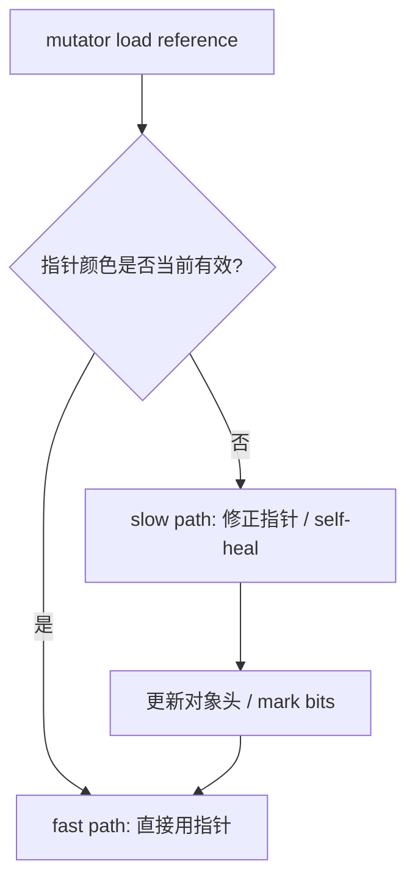

绝大多数访问走 fast path 几条指令就完成;只有当指针"过时"时才走 slow path。这是为什么 ZGC 的吞吐代价不是"每条指令都重"
,而是"少数路径上重"。

#### 为什么 pause 不随堆增长

这是 ZGC 设计的关键结论。原因是:ZGC 的 STW 阶段**只做 root scan 等本地工作**:

- STW 1:mark start(initial mark)。扫描 root(thread stacks、global JNI refs、class loader、JVMTI 等)。
- STW 2:mark end / weak root 处理。范围很小。
- STW 3(如果有):relocate start。

而真正的 heap 扫描和对象搬迁都在 **concurrent** 阶段做,mutator 同时在跑。barrier 保证:即便 GC 正在搬一个对象,mutator
读到的引用永远是有效地址。

root 数量 ≈ O(threads + globals),和 heap 大小无关。所以 ZGC pause 几乎不随 heap 增长。代价是 mutator 路径上每个引用 load
都要做 fast-path 检查,这就是 ZGC 吞吐低于 G1 / Parallel 的真正原因。

#### Store barrier(Generational 才加)

非分代 ZGC 只有 load barrier。要分代,必须知道"哪些 old region 指向了 young region"(cross-gen reference)
,这需要写时记录。Generational ZGC(JEP 439)因此引入了 store barrier:

- 写 old → young 时,store barrier 把这个引用记录下来。
- young collection 就不需要扫整个 old generation 来找 cross-gen 引用,大幅降低 young GC work。

store barrier 是 generational ZGC 通过两个 barrier 协作把 pause 压下来的关键,也是它"又能低延迟又能利用分代假设"的工程基础。

#### 内存与平台代价

- JDK 15 之前 ZGC 用 multi-mapping,3 倍虚拟地址空间;JDK 15+ 改为单映射,但 page table 仍比 G1 重。
- 32 位平台不支持 ZGC(没有足够高位放颜色)。
- aarch64 上 ZGC 同样可用,但与 x86_64 在 cache / TLB 行为上不完全一样,生产 benchmark 不能简单互推。

### 回收流程

Generational ZGC 把 heap 分成 young / old 两个逻辑 generation,并保持 ZGC 的核心:colored pointers、load barriers、store
barriers、concurrent marking、concurrent relocation。

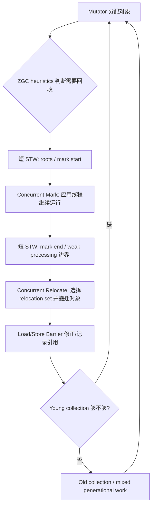

### ZGC 的关键取舍

ZGC 的 pause 很低,但不是免费:

- 它需要 heap headroom。如果应用分配速度超过 ZGC 并发回收速度,会出现 `ZAllocationStall`。
- 它需要 CPU headroom。并发 GC 线程和应用线程同时运行,CPU 紧张时可能不是 pause 长,而是应用吞吐下降或 stall。
- 它靠 barrier 维持并发搬迁下的引用一致性,读 / 写引用路径有额外开销。
- 对极端小 heap 或 headroom 很低的场景,ZGC 可能比 G1 更差。Mill 示例中 heap 只有 live set 约 2 倍时,ZGC pause 和吞吐都不占优。

### 调优方向

1. **首要参数是 `-Xmx`**。ZGC 官方文档明确指出最大 heap 是主要调优项:必须容纳 live set,并给并发回收期间的分配留 headroom。
2. 用 `SoftMaxHeapSize` 表达"希望常态占用",用 `Xmx` 表达"不能超过的硬上限"。这比把 `Xmx` 卡得很死更适合 ZGC。
3. 对极低延迟服务,考虑 `-Xms = -Xmx` + `-XX:+AlwaysPreTouch`,避免运行时 commit/uncommit / page fault。
4. 关注 `ZAllocationStall`。出现 stall 时,通常先增大 heap、降低分配速率、增加 CPU headroom,而不是急着微调内部参数。
5. 在 Linux 上谨慎看 THP / large pages。ZGC 文档不推荐 latency-sensitive 应用依赖 THP 的默认 always 行为;显式 large pages
   或 madvise 模式需要环境验证。

## Shenandoah

Shenandoah 是 Red Hat 主导的低延迟并发 GC,设计目标和 ZGC 接近:把 pause 控制在与 heap 大小无关的 root-set 量级。它最早由
Christine Flood 等人在 2014 年提出,JEP 189 进入上游,经历了几次重要的设计演进。

```bash
# 只在 Temurin / Corretto / RHEL OpenJDK 等带 Shenandoah 的发行版有效
java -XX:+UseShenandoahGC ...
```

### 设计演进

| 阶段             | 关键设计                   | 说明                                                                                |
|----------------|------------------------|-----------------------------------------------------------------------------------|
| JDK 12-16(实验性) | Brooks pointer         | 每个对象多一个隐藏指针,指向对象自己。relocate 时先改 Brooks pointer,所有旧引用仍可访问。代价:每个对象多 8 字节            |
| JDK 17         | load reference barrier | 改用引用加载时检查的 barrier,不再需要 Brooks pointer 的对象头开销,大幅降内存。具体演进见 OpenJDK Shenandoah wiki |
| JDK 21+        | Generational 实验性       | 类似 ZGC 的分代演进,目前仍在稳定中                                                              |

现代 Shenandoah 用 load reference barrier(不是 ZGC 的 colored pointer)解决"并发移动期间的引用一致性"问题。两者从效果上类似——mutator
永远不会拿到无效指针——但实现路径不同。

### Shenandoah vs ZGC

| 维度               | ZGC                            | Shenandoah                                |
|------------------|--------------------------------|-------------------------------------------|
| 引用一致性机制          | colored pointer + load barrier | load reference barrier(无 colored pointer) |
| region 模型        | zpage(可变)                      | region(固定)                                |
| humongous object | 单独处理                           | 与普通 region 统一处理,但有特殊路径                    |
| 分代               | JDK 23 起默认分代                   | 分代仍在稳定中(JDK 21-25 阶段)                     |
| Oracle JDK 支持    | 是                              | 否(只在 OpenJDK 上游和其他发行版)                    |
| 典型 pause         | sub-ms ~ 几 ms,几乎不随堆增长          | sub-ms ~ 几 ms,几乎不随堆增长                     |
| 大堆场景             | 业界更多生产案例                       | RHEL / Red Hat 系生态更多案例                    |

设计目标几乎一样,实测性能在多数 workload 上接近;选型通常被**发行版支持**和**团队熟悉度**主导,而不是单点性能差异。

### 何时该评估它

- 你已经在用 Temurin / Corretto / RHEL OpenJDK 等带 Shenandoah 的发行版,迁移成本低。
- 你的 workload 在 ZGC 上 headroom 不够或 stall 多,想试另一个并发 GC 实现。
- 你的运维栈(RHEL / Red Hat 系)对 Shenandoah 的支持比 ZGC 更久。

### 何时**不**该评估它

- 在 Oracle JDK 上。Oracle JDK 不带 Shenandoah,迁移到 Temurin 等发行版要先做合规和兼容性评估。
- 团队完全不熟悉,且当前 G1 / ZGC 表现已经达标。换 GC 是大事,没有"必须换"的理由不要为了换而换。

### 参考阅读

OpenJDK Shenandoah wiki、Aleksey Shipilev 和 Roman Kennke 的 JVM 峰会演讲、Christine Flood
的早期论文。具体调优细节看发行版自带文档,不同发行版参数默认值有差异。

## Serial 与 Epsilon

这两个收集器在生产中用得少,但在边界场景里有不可替代的位置。补一节避免让人误以为 HotSpot 只有 Parallel / G1 / ZGC。

### Serial

`-XX:+UseSerialGC`。单线程、stop-the-world、分代(young 用 copying,old 用 mark-sweep-compact)。

适用:

- 单核或极小容器(几百 MB heap)。
- 嵌入式 / 资源极度受限环境。
- 客户端应用、CLI 工具(启动快、footprint 小)。

为什么不是历史遗物:

- 在 1-2 核小机器上,Parallel / G1 的同步开销可能比 Serial 的单线程串行还慢。
- JEP 523 一直想让 G1 在所有环境都默认,但没 delivered,小环境默认仍可能是 Serial,这是有意为之。

### Epsilon

`-XX:+UseEpsilonGC`(实验性,需要 `-XX:+UnlockExperimentalVMOptions`)。No-op memory manager:只分配,不回收。

用途(全是性能测试场景):

- 测量"如果没有 GC 干扰,纯 JVM allocation 路径吞吐多少"。在 JMH 基准里把 GC 当作常量隔离掉。
- 测试 JVM 启动时间(不被任何 GC 影响)。
- 验证 native 内存或 direct buffer 行为时,排除 GC 噪声。

注意:Epsilon 不回收内存,heap 一旦满就直接 OOM。它必须用于"已知整个 workload 内存峰值 < heap"的实验场景,不能跑生产。

## JVM 内存视角: Java heap 之外

容器里的 OOMKilled 和很多"GC 调不下来"的问题,其实都不在 Java heap。这一节统一讲 JVM 内存结构。

### 内存组成

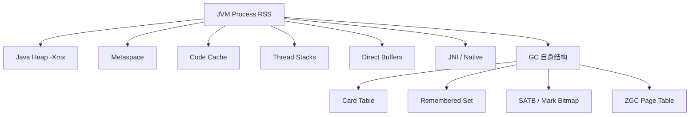

| 区域                  | 控制参数                        | 默认 / 经验               | GC 看得到吗                     |
|---------------------|-----------------------------|-----------------------|-----------------------------|
| Java heap           | `-Xmx` / `-Xms`             | 容器 limit 的 70-80%     | 是                           |
| Metaspace           | `-XX:MaxMetaspaceSize`      | 默认无上限,推荐显式设 256-512MB | 部分通过 `jdk.MetaspaceSummary` |
| Code cache          | `-XX:ReservedCodeCacheSize` | 240MB                 | 间接                          |
| Thread stacks       | `-Xss` × 线程数                | 默认 1MB;高并发服务可能几 G     | 否                           |
| Direct buffers      | `-XX:MaxDirectMemorySize`   | 默认 ≈ `-Xmx`           | 部分(NIO Buffer events)       |
| JNI / native malloc | 无统一参数                       | 看 native 代码           | 否                           |
| GC 结构               | 不直接可调                       | 取决于 GC 和 heap 大小      | 否                           |

### 容器里的常见坑

1. **只看 `-Xmx`**:Metaspace、direct buffer、thread stack 加起来在容器里很容易几百 MB 到 1 GB。`-Xmx = container limit`
   等于一定会被 OOMKilled。
2. **Direct buffer 泄漏**:JVM 的 GC 完全感知不到 native 堆外的 NIO buffer。一个 hidden direct buffer leak 会悄悄把 RSS 推过
   limit,OOMKilled 而无任何 OOM 异常。
3. **JNI malloc**:JNI 代码 `malloc` 的内存,JVM 看不到。需要靠 native memory tracking 间接观察,或直接看
   `/proc/<pid>/status` 的 `VmRSS`。
4. **Metaspace 失控**:动态代理、字节码生成框架(CGLIB、Javassist)、热部署会持续加载新类,Metaspace 涨到 GB 级是真实事故。

### 怎么观测

- **Native Memory Tracking(NMT)**:

  ```bash
  java -XX:NativeMemoryTracking=summary ...
  jcmd <pid> VM.native_memory summary
  ```

  给出 JVM 内部分类的内存总量。注意:NMT 看不到纯 native malloc(除非走 JVM 内部 arena),JNI 直接

  ```
  malloc
  ```

  仍要靠

  ```
  /proc
  ```

  或外部工具。

- **`/proc/<pid>/status` 和 `smaps`**:Linux 上 RSS 的真相。`VmRSS`、`VmSwap`、`RssAnon` / `RssFile` 区分匿名页和文件页。

- **JFR direct buffer 事件**:`jdk.DirectBufferStatistics`(JDK 16+)。

- **外部工具**:`pmap`、`smem`、async-profiler 的 `--alloc` / `--live` 模式。

## 观测切入点

### JFR 事件

JFR 是 GC 调优的核心观测工具之一。下面事件名按本机 JDK `25.0.3` 的 `jfr metadata` 验证整理;不同 JDK 版本、发行版、GC
组合会有差异。

#### 通用 GC 事件

| 事件                                   | 关注字段                                                       | 用途                                                             |
|--------------------------------------|------------------------------------------------------------|----------------------------------------------------------------|
| `jdk.GarbageCollection`              | `name`, `cause`, `duration`, `sumOfPauses`, `longestPause` | GC 总览:谁触发、停了多久、是否有异常 cause                                     |
| `jdk.YoungGarbageCollection`         | `duration`, `tenuringThreshold`                            | young GC 与 tenuring 变化                                         |
| `jdk.OldGarbageCollection`           | `duration`                                                 | old / full 方向的回收事件                                             |
| `jdk.GCPhasePause` / `Level1-4`      | `name`, `duration`                                         | 拆解 pause 内部阶段,找 root scan / object copy / reference processing |
| `jdk.GCPhaseConcurrent` / `Level1-2` | `name`, `duration`                                         | 观察并发标记、并发清理、并发 relocation                                      |
| `jdk.GCHeapSummary`                  | `when`, `heapUsed`, `heapSpace`                            | GC 前后 heap 使用变化                                                |
| `jdk.MetaspaceSummary`               | `gcThreshold`, metaspace/data/class sizes                  | 类加载、动态代理、agent 引起的 metaspace 压力                                |
| `jdk.GCCPUTime`                      | `userTime`, `systemTime`, `realTime`                       | 区分 GC worker CPU、OS/system time、真实停顿                           |
| `jdk.SystemGC`                       | `invokedConcurrent`, stack trace                           | 找 `System.gc()` 或外部工具造成的 full / concurrent explicit GC         |

#### 分配与晋升事件

| 事件                                | 关注字段                                                     | 用途                                            |
|-----------------------------------|----------------------------------------------------------|-----------------------------------------------|
| `jdk.ObjectAllocationInNewTLAB`   | `objectClass`, `allocationSize`, `tlabSize`, stack trace | 高分配热点,适合短时间 profiling                         |
| `jdk.ObjectAllocationOutsideTLAB` | `objectClass`, `allocationSize`, stack trace             | 大对象 / 无法进入 TLAB 的分配,常与 humongous 或大 buffer 有关 |
| `jdk.AllocationRequiringGC`       | `size`, stack trace, `gcId`                              | 哪次分配逼出了 GC                                    |
| `jdk.PromoteObjectInNewPLAB`      | `objectClass`, `objectSize`, `tenuringAge`, `tenured`    | 对象从 young 复制 / 晋升,定位 survivor / old 压力        |
| `jdk.PromoteObjectOutsidePLAB`    | 同上                                                       | 晋升不走 PLAB,常用于细查 promotion 行为                  |
| `jdk.TenuringDistribution`        | `age`, `size`                                            | 判断对象寿命分布是否适合当前 young / survivor 策略            |

#### G1 独有事件

| 事件                          | 关注字段                                                                                | 用途                                       |
|-----------------------------|-------------------------------------------------------------------------------------|------------------------------------------|
| `jdk.G1GarbageCollection`   | `type`, `duration`                                                                  | 区分 normal young、concurrent start、mixed 等 |
| `jdk.G1HeapSummary`         | eden/survivor/old used, regions                                                     | 看 young / old region 使用变化                |
| `jdk.G1AdaptiveIHOP`        | threshold, current occupancy, predicted allocation rate, predicted marking duration | 判断 G1 是否太晚开始 marking                     |
| `jdk.G1BasicIHOP`           | threshold, recent allocation rate, last marking duration                            | IHOP 基础诊断                                |
| `jdk.G1MMU`                 | time slice, gc time, pause target                                                   | 判断是否违反 minimum mutator utilization       |
| `jdk.EvacuationInformation` | cSet regions, bytes copied, regions freed                                           | mixed / young evacuation 成本与收益           |
| `jdk.EvacuationFailed`      | evacuation failure data                                                             | G1 Full GC 前的高危信号                        |
| `jdk.GCReferenceStatistics` | reference type, count                                                               | reference processing 长尾排查                |

#### ZGC 独有事件

| 事件                            | 关注字段                                        | 用途                                    |
|-------------------------------|---------------------------------------------|---------------------------------------|
| `jdk.ZYoungGarbageCollection` | `duration`, `tenuringThreshold`, `gcId`     | Generational ZGC young collection     |
| `jdk.ZOldGarbageCollection`   | `duration`, `gcId`                          | Generational ZGC old collection       |
| `jdk.ZAllocationStall`        | `duration`, `type`, `size`, stack trace     | ZGC 最值得盯的事件:应用线程等 GC 腾内存              |
| `jdk.ZPageAllocation`         | `type`, `size`, `successful`, `nonBlocking` | ZPage 分配失败 / 阻塞线索                     |
| `jdk.ZRelocationSet`          | `total`, `empty`, `relocate`                | relocation set 规模与搬迁压力                |
| `jdk.ZRelocationSetGroup`     | candidate/selected pages, relocate bytes    | generational 分组 relocation 诊断         |
| `jdk.ZUncommit`               | `uncommitted`, `duration`                   | 内存还给 OS 的行为,排查 footprint / latency 抖动 |

### GC log

GC log 是 JFR 之外的另一只眼睛,实时性强、开销小。

> 下面五段都采集自一台 Arch Linux + **OpenJDK 26.0.1**、20 核 / 30G RAM 的机器。workload 是一个固定的 GcStress 程序:堆里维护
> N 个 1MB `byte[]` 作为 live set,主循环不停分配 4KB 短命数组制造 young 压力,可选周期性大数组制造 humongous。每种场景通过
`-Xms`/`-Xmx`、live set 大小、humongous 间隔的组合触发,workload 本身不变。日志只保留 info 级、去掉重复的 metaspace/ergo
> 细节,时间戳也只保留 `[uptime]` 一段。

#### G1 Young GC(健康)

256M heap,50M live set(每个 1MB chunk 在 1MB region 下是 humongous),无 humongous 周期:

```
[5.056s][info][gc,start    ] GC(7) Pause Young (Normal) (G1 Evacuation Pause)
[5.056s][info][gc,task     ] GC(7) Using 6 workers of 15 for evacuation
[5.058s][info][gc,phases   ] GC(7)   Pre Evacuate Collection Set: 0.30ms
[5.058s][info][gc,phases   ] GC(7)   Merge Heap Roots: 0.06ms
[5.058s][info][gc,phases   ] GC(7)   Evacuate Collection Set: 0.32ms
[5.058s][info][gc,phases   ] GC(7)   Post Evacuate Collection Set: 0.49ms
[5.058s][info][gc,phases   ] GC(7)   Other: 0.05ms
[5.058s][info][gc,heap     ] GC(7) Eden regions: 139->0(139)
[5.058s][info][gc,heap     ] GC(7) Survivor regions: 1->1(14)
[5.058s][info][gc,heap     ] GC(7) Old regions: 2->2
[5.058s][info][gc,heap     ] GC(7) Humongous regions: 100->100
[5.058s][info][gc          ] GC(7) Pause Young (Normal) (G1 Evacuation Pause) 240M->101M(256M) 1.448ms
```

看到什么:total pause 1.4ms,`Pre/Post Evacuate Collection Set` 占比最高(线程协调、reference processing),
`Evacuate Collection Set` 本身只占 0.32ms——说明这个 workload 里 object copy 很便宜,大部分时间花在 GC 协调本身。Eden
完整回收(139->0),survivor / old / humongous 数量稳定——典型健康 young GC。注意 `Humongous regions: 100->100` 提示有 100 个
humongous region 不动,这是因为 50 个 1MB 数组(加上 array header超过 1MB region 大小)各跨 2 个 region,合计 100
region——它们不会被 young GC 回收。

#### G1 Mixed GC(完整 mark cycle)

1.28G heap,400M live set,run 45s。这是 GC(0)→GC(3) 的完整序列:concurrent start 触发 → mark cycle → prepare mixed → 第一次
mixed GC。

```
[0.081s][info][gc,start   ] GC(0) Pause Young (Concurrent Start) (G1 Humongous Allocation)
[0.083s][info][gc         ] GC(0) Pause Young (Concurrent Start) (G1 Humongous Allocation) 575M->575M(1280M) 2.541ms
[0.083s][info][gc         ] GC(1) Concurrent Mark Cycle
[0.083s][info][gc,marking ] GC(1) Concurrent Scan Root Regions 0.322ms
[0.085s][info][gc,marking ] GC(1) Concurrent Mark From Roots 1.337ms
[0.086s][info][gc,start   ] GC(1) Pause Remark
[0.086s][info][gc         ] GC(1) Pause Remark 623M->623M(1280M) 0.949ms
[0.087s][info][gc,start   ] GC(1) Pause Cleanup
[0.087s][info][gc         ] GC(1) Pause Cleanup 629M->629M(1280M) 0.046ms
[0.087s][info][gc         ] GC(1) Concurrent Mark Cycle 3.688ms
[3.754s][info][gc,start   ] GC(2) Pause Young (Prepare Mixed) (G1 Evacuation Pause)
[3.756s][info][gc         ] GC(2) Pause Young (Prepare Mixed) (G1 Evacuation Pause) 1114M->801M(1280M) 2.570ms
[5.123s][info][gc,start   ] GC(3) Pause Young (Mixed) (G1 Evacuation Pause)
[5.126s][info][gc         ] GC(3) Pause Young (Mixed) (G1 Evacuation Pause) 1145M->801M(1280M) 2.301ms
```

看到什么:

- GC(0) 标记 `Concurrent Start` 是 mark cycle 的触发点——它的 cause 是 `G1 Humongous Allocation`,意味着这次 young GC
  期间检测到 humongous 分配且 old occupancy 已过 IHOP,所以顺势启动并发标记。
- GC(1) 是并发标记本身,内部只有两个 STW 段:`Pause Remark 0.949ms`(完成 SATB、引用处理、类卸载)和 `Pause Cleanup 0.046ms`(
  计算 mixed GC 候选 region)。其余 `Concurrent Mark From Roots` / `Concurrent Scan Root Regions` 都不算 pause。
- GC(2) `Prepare Mixed` 是 mark cycle 结束后、第一次真正 mixed GC 前的过渡 young GC。
- GC(3) `Mixed` 才是真正的 mixed GC——会回收 young region 加一部分被标为 candidate 的 old region。

注意:Pause 时间都不长(~2.5ms),因为 heap 大、压力适中。换到 tight heap + heavy humongous 场景就是下一节的反面教材。

#### G1 Evacuation Failure → Full GC(危险)

420M heap + 280M live set(全部 1MB humongous)+ 每 200ms 分配 4MB humongous。live set 几乎吃满整个 heap,humongous
还在堆积——很快就会 evac fail。

```
[0.050s][info][gc,heap     ] GC(2) Humongous regions: 416->416
[0.050s][info][gc          ] GC(2) Pause Young (Prepare Mixed) (G1 Humongous Allocation) (Evacuation Failure: Allocation) 418M->418M(420M) 0.822ms
[0.050s][info][gc,ergo     ] Attempting full compaction
[0.050s][info][gc,start    ] GC(3) Pause Full (G1 Compaction Pause)
[0.050s][info][gc,task     ] GC(3) Using 10 workers of 15 for full compaction
[0.050s][info][gc,phases   ] GC(3) Phase 1: Mark live objects 0.516ms
[0.050s][info][gc,phases   ] GC(3) Phase 2: Prepare compaction 0.089ms
[0.051s][info][gc,phases   ] GC(3) Phase 3: Adjust pointers 0.295ms
[0.051s][info][gc,phases   ] GC(3) Phase 4: Compact heap 0.075ms
[0.051s][info][gc,phases   ] GC(3) Phase 5: Reset Metadata 0.153ms
[0.052s][info][gc,heap     ] GC(3) Humongous regions: 416->416
[0.052s][info][gc          ] GC(3) Pause Full (G1 Compaction Pause) 418M->417M(420M) 1.841ms
```

看到什么:

- GC(2) 的 cause 字段里直接出现 `(Evacuation Failure: Allocation)`——这是 G1 主动声明"我尝试 evacuate 但没空间"。
  `Attempting full compaction` 是 ergo 决定退化到 Full GC。
- GC(3) 是经典的 Full GC 五阶段:Mark live objects → Prepare compaction → Adjust pointers → Compact heap → Reset
  Metadata。
- **本次 Full GC 几乎没回收任何东西**:418M→417M,只省了 1MB。原因:`Humongous regions: 416->416`——堆里有 416 个 humongous
  region,它们都还活着(cache 持有引用),Full GC 不能搬动也不能合并。后续日志会一连串 Full GC,因为每次都没用,直到
  `GC overhead limit exceeded` 或 OOM。

诊断方向(这个场景里需要全做):

- heap 不够(420M 太紧)→ 加 heap
- humongous 太多(416 个 1MB region)→ 减小数组 / 改 buffer 复用
- live set 太大 → 找 cache leak
- `G1HeapRegionSize` 调大让对象不再触发 humongous(但这台机器已经是 1MB region,再调作用有限)

#### ZGC young collection(健康)

Generational ZGC,2G heap,400M live set,无 humongous,run 20s。下面是 GC(0) 完整一次 young collection 的 phases:

```
[0.599s][info][gc,phases   ] GC(0) Y: Pause Mark Start (Major) 0.008ms
[0.600s][info][gc,phases   ] GC(0) Y: Concurrent Mark 1.648ms
[0.601s][info][gc,phases   ] GC(0) Y: Pause Mark End 0.004ms
[0.601s][info][gc,phases   ] GC(0) Y: Concurrent Mark Free 0.005ms
[0.601s][info][gc,phases   ] GC(0) Y: Concurrent Reset Relocation Set 0.000ms
[0.601s][info][gc,phases   ] GC(0) Y: Concurrent Select Relocation Set 0.686ms
[0.602s][info][gc,phases   ] GC(0) Y: Pause Relocate Start 0.002ms
[0.602s][info][gc,phases   ] GC(0) Y: Concurrent Relocate 0.656ms
[0.602s][info][gc,heap     ] GC(0) Y:   Free: 1820M(89%) 1788M(87%) 1756M(86%) 1752M(86%)
[0.602s][info][gc,heap     ] GC(0) Y:   Used: 228M(11%) 260M(13%) 292M(14%) 296M(14%)
[0.602s][info][gc,phases   ] GC(0) Y: Young Generation 228M(11%)->296M(14%) 0.004s
```

看到什么:

- 三个 STW pause:`Pause Mark Start 0.008ms`、`Pause Mark End 0.004ms`、`Pause Relocate Start 0.002ms`。三个加起来 **14 微秒
  **,完全 sub-ms。
- 中间的 `Concurrent Mark 1.648ms`、`Concurrent Select Relocation Set 0.686ms`、`Concurrent Relocate 0.656ms` 都是 *
  *concurrent**,mutator 同时在跑——它们不出现在 pause 里。
- 整个 cycle 的 wall clock(`0.004s` = 4ms)和 pause(0.014ms)差了三个数量级,这就是 ZGC 的设计目标:**STW 几乎只是 root scan
  的开销,与 heap 大小无关**。
- `Y:` 前缀是 young collection;同一次 GC 还会触发 `O:` Old Generation(同一日志块里),分代 ZGC 把 young 和 old 在同一次 GC
  里分别处理。

#### ZGC Allocation Stall(警告)

550M heap + 500M live set,headroom < 10%。run 25s 最终 OOM。中间触发了几次 stall:

```
[0.120s][info][gc,alloc    ] GC(8) y: Allocation Stalls:          0                1                1                1
[0.120s][info][gc,heap     ] GC(8) y:   Used: 544M(99%) 550M(100%) 550M(100%) 550M(100%)
[0.120s][info][gc          ] GC(9) Minor Collection (Allocation Stall)
[0.121s][info][gc          ] GC(9) Minor Collection (Allocation Stall) 550M(100%)->550M(100%) 0.001s
[0.124s][info][gc          ] Allocation Stall (main) 2.941ms
```

看到什么:

- GC(8) 的 `Allocation Stalls: 0 1 1 1` 表示在 Relocate Start 这一列发生了 1 次 stall。同时间的 heap usage
  `Used: 544M(99%)` 说明堆几乎是满的。
- GC(9) 的 cause 直接是 `Allocation Stall`,GC 是被 stall 的分配请求逼出来的,不是 ZGC 自己的 heuristic。
- `[0.124s][info][gc] Allocation Stall (main) 2.941ms` 是真正的 stall 行:主线程在分配时被卡住 2.941ms 等 GC 腾出内存。

诊断方向(按可能性排序):

- heap headroom 不够(这台 550M 几乎被 500M live set 撑爆)→ 增大 `-Xmx` 到 live set 的 2-4 倍
- 分配速率太高 → 改应用,减少热路径分配
- CPU 不够,并发 GC 跟不上 → 增 CPU 或降低应用并发
- 还要看 `ZPageAllocation` 事件,确认是否 ZPage 申请本身被阻塞

注意:JDK 26 的 Generational ZGC 在 headroom 2x(700M heap / 500M live set)场景下**完全没有 stall**(整个 25s 跑下来
`Allocation Stalls: 0 0 0 0`)。早期 ZGC 在 headroom 2x 表现不佳的印象,在 generational 版本上已经被很大程度改善——但
headroom < 1.1x 这种极端紧的场景仍然会 stall,这个边界没有消失。

ZGC 调优里,stall 是最重要的负面信号;一旦稳定出现,先看 headroom 再看 CPU,不要急着微调内部 flag。

### JFR ↔ GC log 关联

GC log 和 JFR 是**同一次 GC 的两种视角**,不是两套独立数据。理解它们的对应关系,才能用最小的开销拿到需要的细节。

#### 主键对齐:`gcId` 与 startTime

每一次 GC 在 log 和 JFR 里都能用 `gcId`(log 写作 `GC(N)`,JFR 字段 `gcId`)对齐;没有 gcId 的 JFR-only 事件(ZGC 的
stall、TLAB 分配)就用 `startTime` 对齐到最近的 log 行。下面用 g1-full 场景的同一组数据演示:

**GC log 视角**(文本流,实时):

```
[13.568s][info][gc,start    ] GC(43) Pause Full (G1 Compaction Pause)
[13.568s][info][gc,task     ] GC(43) Using 15 workers of 15 for full compaction
[13.568s][info][gc,phases   ] GC(43) Phase 1: Mark live objects
[13.570s][info][gc,phases   ] GC(43) Phase 2: Prepare compaction
[13.570s][info][gc,phases   ] GC(43) Phase 3: Adjust pointers
[13.571s][info][gc,phases   ] GC(43) Phase 4: Compact heap
[13.571s][info][gc          ] GC(43) Pause Full (G1 Compaction Pause) 568M->568M(768M) 8.265ms
```

**JFR 视角**(`jfr print --json --events jdk.GarbageCollection`):

```json
{
  "type": "jdk.GarbageCollection",
  "values": {
    "startTime": "2026-06-13T21:37:13.080897459+08:00",
    "duration": "PT0.008265184S",
    "gcId": 43,
    "name": "G1Full",
    "cause": "G1 Compaction Pause",
    "sumOfPauses": "PT0.008265184S",
    "longestPause": "PT0.008265184S"
  }
}
```

两边 `gcId=43` / `GC(43)` 是同一次 Full GC,duration 都约 8.27ms,`name="G1Full"` 对应 log 里的
`Pause Full (G1 Compaction Pause)`。

#### log 行 ↔ JFR 事件 类型映射

| log 关键字                                       | JFR 事件 name                                  | 备注                                                    |
|-----------------------------------------------|----------------------------------------------|-------------------------------------------------------|
| `Pause Young (Normal)`                        | `G1New`,cause=`G1 Evacuation Pause`          | G1 普通 young GC                                        |
| `Pause Young (Concurrent Start)`              | `G1New` + 紧随其后的 `G1Old`                      | 后者代表 mark cycle 启动                                    |
| `Pause Young (Mixed)` / `(Prepare Mixed)`     | `G1New`,cause 不变                             | mixed 阶段在 `jdk.G1EvacuationOldStatistics` 里看          |
| `Pause Full (G1 Compaction Pause)`            | `G1Full`                                     | 真正的 serial-ish Full GC                                |
| `Pause Remark` / `Pause Cleanup`              | `jdk.GCPhasePauseLevel1/2` 标记 remark/cleanup | 不发 `jdk.GarbageCollection`,因为属于 cycle 的 STW phase     |
| ZGC `Pause Mark Start / End / Relocate Start` | `jdk.GCPhasePause`(level 0)                  | ZGC 不发 `jdk.GarbageCollection.pause`,pause 走 phase 事件 |
| `Minor Collection (Allocation Stall)`         | `ZGC Minor`,cause=`Allocation Stall`         | 配 `jdk.ZAllocationStall` 看具体 stall 时长                 |
| inline `(Evacuation Failure: Allocation)`     | `jdk.EvacuationFailed`(单独事件)                 | log 把标记嵌入 cause 字符串,JFR 拆成独立事件                        |

#### JFR-only 的事件(log 看不到)

下面这些是 JFR 比日志强的地方,排查特定问题必须有:

| 事件                                                        | 解决什么问题                                                                                                                   |
|-----------------------------------------------------------|--------------------------------------------------------------------------------------------------------------------------|
| `jdk.ZAllocationStall`                                    | ZGC 独有。给出**每个被 stall 的应用线程**的 stall 时长和分配大小,这是 log 看不到的——log 只有"统计计数"。                                                   |
| `jdk.OldObjectSample`                                     | 堆里"老对象"抽样带堆栈。GC 本身没问题但 live set 增长时,这是找 cache leak 的最直接路径。                                                               |
| `jdk.GCCPUTime`                                           | 分开 `userTime` / `systemTime` / `realTime`。容器里如果 `realTime` ≫ `userTime`,说明被 throttle / context switch 拖累,不是 GC 本身慢。      |
| `jdk.GCPhasePauseLevel1` / `Level2` / `Level3` / `Level4` | 拆 pause 内部子阶段到 root scan、object copy、reference processing、weak refs 等层级。log 的 `gc+phases=debug` 也有类似信息,但 JFR 是结构化的,容易聚合。 |
| `jdk.ObjectAllocationInNewTLAB` / `OutsideTLAB`           | 带调用栈的分配采样。结合 `-XX:StartFlightRecording=settings=profile`,可以定位"谁在分配"。                                                     |
| `jdk.PromoteObjectInNewPLAB` / `OutsidePLAB`              | 对象晋升路径。survivor 溢出、premature promotion 排查必备。                                                                             |

#### log-only 的信息(JFR 反而不直接)

| log 现象                                               | 为什么 JFR 看不到                                                                          |
|------------------------------------------------------|--------------------------------------------------------------------------------------|
| `[gc,ergo] Attempting full compaction`               | ergo 决策过程只在 log 里出现,JFR 只记录结果事件。                                                     |
| `[gc,heap] Humongous regions: 416->416` 这种 region 计数 | G1 的 region-level 统计走 `jdk.G1HeapSummary`,但旧版本/部分 JDK 不全。                            |
| `[gc,init]` 启动配置全量打印                                 | JFR 有 `jdk.GCConfiguration` / `jdk.BooleanFlag` 等,但 log 一行带 `Using G1` 这种"声明性"输出更直观。 |
| 内联的 `(Evacuation Failure: Allocation)` 注释            | JFR 拆成独立 `jdk.EvacuationFailed` 事件,反而要 join 才能看出 cause。                              |

#### 工程实践

1. **保留 GC log 全量文本 + 同时开 JFR**。GC log 是低开销的"黑匣子",平时没成本,出事一定用得上;JFR 是开 `settings=profile`
   时才有 `OldObjectSample` / allocation sample 这种带栈事件,适合事故复现或定向 profiling,日常生产可以
   `settings=default` 降低开销。
2. **同一 `gcId` 跨源对齐**。看到 JFR 里某个 GC pause 异常,直接拿 `gcId` 去 log 里 `grep "GC(N)"` 就能拿到所有 phase
   子段,不需要再写聚合查询。
3. **JFR 的 ZGC pause 数据更准**。ZGC 的 pause 是 sub-ms 级,log 的 `0.001s` 这种精度只到 1ms,JFR 给出 `PT0.00467ms`
   这种纳秒级数值——分析 ZGC 必须看 JFR。
4. **注意采集方式带来的偏差**。下面这个对照展示了 polling-based JFR 的典型问题:
    - g1-full 场景的 GC log 实际记录了 4 次 `Pause Full (G1 Compaction Pause)`,但 JFR 因为是 `jcmd JFR.dump` 每秒轮询(
      为了对抗 OOM 时 JVM 来不及 dumponexit),只捕到 2 次 `G1Full` 事件。
    - 教训:对**会快速崩溃的 workload**,JFR 不是 ground truth,GC log 才是。JFR 拿结构化字段,log 拿完整性。
5. **JFR JSON 输出方便自动化**。`jfr print --json --events jdk.GarbageCollection file.jfr` 直接吐结构化数据,适合接入
   CI、回归基线比对;log 解析则要用工具(`gceasy`、`gcviewer`、JFR `--json` + `jq` 等等)。

### 采集命令

生产上建议把 JFR 与 GC log 组合使用:

```bash
jcmd <pid> JFR.start name=gc-profile settings=profile delay=0s duration=10m filename=/tmp/gc-profile.jfr
jcmd <pid> JFR.dump name=gc-profile filename=/tmp/gc-profile.jfr
jcmd <pid> JFR.stop name=gc-profile
```

GC log 推荐写法(**务必加 `-Xlog:async`**):

```bash
java -Xlog:async \
     -Xlog:gc*,gc+heap=info,gc+phases=debug,gc+ergo+cset=debug,gc+cpu=info:\
file=gc.log:time,uptime,level,tags:filecount=5,filesize=100M \
     ...
```

为什么必须 async

GC log 是 GC 线程在 STW 内**同步**写的。如果日志落盘阻塞(容器 IOPS 限流、NFS 抖动、syslog 同步刷盘、宿主磁盘队列拥塞),**STW
pause 会被日志 I/O 直接拉长**——本来 2ms 的 young GC 可能因为 log write 卡了几十毫秒,看起来像 GC 抖动,实际是 I/O
问题。这种"GC log 自己拖累 GC"的现象在 cgroup v1 + throttled 容器里特别常见。

`-Xlog:async` 把所有 logsite 的写操作改为"投递到内存 buffer,独立 logger 线程异步刷盘",GC 线程的写操作保证非阻塞。代价:

- 默认 `drop` 模式:buffer 满时丢消息(不会 backpressure 到 mutator)——生产推荐。
- `stall` 模式:logsite 等 buffer 出空——一般不用,除非审计要求不能丢任何 log。
- buffer 默认 256KB(`-XX:AsyncLogBufferSize=N`),极端高压场景可能丢消息,丢的消息会有 `[info][logging] Drop messages: ...`
  行提示。

反过来用 sync 日志的场景几乎只有:**复现"日志 I/O 本身是不是问题"**——做受控对照时,临时关 async 看 pause 分布是否变化,而不是生产配置。

JDK 26 之后还可以关注 `cpu=info` 退出统计,它会把进程总 CPU 与 GC CPU 分开列出,并把 pause 内、concurrent work、string dedup
等 GC 相邻任务纳入更完整的 GC CPU accounting。

### 可观测性生态

只看 JFR / GC log 不够,生产里通常要和 metrics / tracing 平台组合。

| 工具                      | 在 GC 观测里的作用                                                                                                           |
|-------------------------|-----------------------------------------------------------------------------------------------------------------------|
| Prometheus + Micrometer | 通过 `jvm_gc_pause_seconds`、`jvm_gc_memory_promoted_bytes_total`、`jvm_gc_live_data_size_bytes` 等 metrics,把 GC 数据接进时序数据库 |
| Grafana                 | JVM dashboard,把 GC pause、heap、allocation rate、CPU 画在同一时间轴上                                                            |
| async-profiler          | `-d 60 -e alloc` 出 allocation flamegraph,定位"谁在分配大量对象"                                                                 |
| JFR Toolkit / JMC       | 桌面端 JFR 分析,适合深度调查                                                                                                     |
| Parfait / HawtIO        | 兼容 legacy JMX 的桥接                                                                                                     |

实战要点:

1. **把 GC pause 和应用 p99 / p999 画在同一张图上**——这是判断"GC 是不是导致高延迟"的最直接方式。如果两者 spike 时间对得上,GC
   是凶手;如果不对,继续找。
2. **盯 allocation rate**——它是 GC 压力的领先指标,allocation rate 翻倍往往预示接下来 GC 频率会涨。
3. **保留事故时的 JFR**——不要只看 metrics,metrics 是摘要,JFR 是完整证据。事故后抓不到 JFR,只能猜。
4. **看真实进程 CPU,不只是 JVM 内部**——容器里 CPU throttle / 系统负载会让"GC log 看起来正常但延迟变长"。

## 调优顺序

### 先建立观测基线

| 指标                | 推荐来源                                         | 判断问题                                               |
|-------------------|----------------------------------------------|----------------------------------------------------|
| allocation rate   | JFR allocation events / GC log               | 分配速率是否超过 GC 并发回收能力                                 |
| live set          | full / old / mixed GC 后 heap used            | heap 中真正活着的对象有多大                                   |
| promotion rate    | JFR promotion events / tenuring distribution | young 太小、对象中寿命、缓存过大                                |
| pause breakdown   | `GCPhasePause*`, `gc+phases`                 | root scan、object copy、reference、class unloading 谁慢 |
| humongous objects | G1 log `Humongous regions` / outside TLAB    | 大对象是否导致碎片和提前 marking                               |
| allocation stall  | `jdk.ZAllocationStall`                       | ZGC 是否 heap / CPU headroom 不足                      |
| GC CPU            | `GCCPUTime`, JDK 26 `cpu=info`               | 低 pause 是否换来过高 CPU 成本                              |
| explicit GC       | `jdk.SystemGC`                               | 应用 / 工具是否在主动触发 GC                                  |
| native / RSS      | NMT、`/proc/<pid>/status`                     | 容器 OOMKilled 风险、JNI / direct buffer 泄漏             |

### 再改应用分配形态

GC flag 往往修不了对象生命周期问题:

- 大对象:拆分 buffer、复用 direct / native buffer、避免请求路径构造巨大数组。
- 短命对象:减少热路径临时对象、日志拼接、装箱、stream / lambda 过度分配。
- 中寿命对象:缓存、批处理窗口、队列堆积最容易破坏分代假设。
- 长寿命对象:live set 越大,Parallel / G1 的 old work 越重,ZGC 也需要更多 headroom。
- Reference-heavy cache:大量 `SoftReference` / `WeakReference` 会把成本转移到 reference processing。

### 最后改 GC 参数

| 目标          | G1                                                               | Parallel                        | ZGC                                         |
|-------------|------------------------------------------------------------------|---------------------------------|---------------------------------------------|
| 降低 pause    | 调低 `MaxGCPauseMillis`,但观察吞吐;降低 young 上限;处理 humongous / reference | 降 young 或减少 live set,但 STW 本质不变 | 增 heap / headroom,固定 `Xms=Xmx`,避免 commit 抖动 |
| 提高吞吐        | 放宽 `MaxGCPauseMillis`,升级 JDK 26+,减少 barrier-heavy 写入模式           | 默认就偏吞吐;适当加 heap 和 GC threads    | 增 CPU / headroom,但 ZGC 不是吞吐优先               |
| 降 footprint | G1 默认会保守;可看 periodic GC、heap free ratio                          | 减 heap,但可能拉长 pause              | `SoftMaxHeapSize` + `ZUncommit`             |
| 避免 Full GC  | 更早 marking、增 reserve、减少 humongous、加 heap                         | 增 heap,减少 old pressure          | 关注 stall,不是传统 Full GC 模型                    |

## 反模式

实战里反复出现的错误。

1. **"ZGC / Shenandoah 总是更好"**——headroom 不足时,低延迟 GC 会以 stall、吞吐下降、CPU 飙高反过来咬你。Mill 数据里 heap =
   live set 2x 时 ZGC 输给 G1 不是个例。
2. **"GC 线程越多越好"**——ParallelGCThreads 随便调高,会带来 worker 间同步开销、PLAB 碎片、CPU 抢占 mutator;5/8 heuristic
   是经验值不是偷懒。
3. **"第一步就调 IHOP / `G1HeapRegionSize`"**——绝大多数 case 里,G1 的自适应已经够用;手动调这些应该是在 measure
   之后、用具体数据驱动的最后一步。
4. **"看到 Full GC 就加 heap"**——Full GC 可能是 humongous、promotion failure、metaspace 满、`System.gc()` 触发、JNI
   pinning。不找原因,光加 heap 只是把事故时间点延后。
5. **"`-XX:+DisableExplicitGC` 一刀切"**——某些库(`DirectByteBuffer`、RMI、JNI signer)依赖 `System.gc()` 触发清理,禁掉后会出现
   native 内存涨或 GC 永不发生;看实际行为再决定。
6. **"拿别人的 benchmark 当自己 SLA"**——JEP 333 的 SPECjbb、Mill 的 M1 ARM 数据、第三方的 Renaissance 跑分,都不能直接套到自己的
   workload、自己的硬件、自己的 JDK 版本上。所有数字必须自己重测。
7. **"固定 young size(`-Xmn` / `NewRatio`)"**——在 G1 上,这等于夺走它最重要的 pause 调节手段;ZGC / Shenandoah 也不需要这种参数。
8. **"只盯 Java heap"**——容器 OOMKilled、性能抖动的实际原因常常在 Metaspace、direct buffer、JNI、thread stack、CPU
   throttle。GC log 看起来一切正常,RSS 已经到 limit。

## 参考来源

- OpenJDK JEP 248: Make G1 the Default Garbage Collector, https://openjdk.org/jeps/248
- OpenJDK JEP 523: Make G1 the Default Garbage Collector in All Environments, https://openjdk.org/jeps/523
- OpenJDK JEP 333: ZGC: A Scalable Low-Latency Garbage Collector, https://openjdk.org/jeps/333
- OpenJDK JEP 377: ZGC: A Scalable Low-Latency Garbage Collector Production, https://openjdk.org/jeps/377
- OpenJDK JEP 439: Generational ZGC, https://openjdk.org/jeps/439
- OpenJDK JEP 474: ZGC: Generational Mode by Default, https://openjdk.org/jeps/474
- OpenJDK JEP 490: ZGC: Remove the Non-Generational Mode, https://openjdk.org/jeps/490
- OpenJDK JEP 522: G1 GC: Improve Throughput by Reducing Synchronization, https://openjdk.org/jeps/522
- OpenJDK JEP 189: Shenandoah: An Ultra-Low-Pause-Time Garbage Collector, https://openjdk.org/jeps/189
- OpenJDK JEP 379: Shenandoah: A Low-Pause-Time Garbage Collector (Production), https://openjdk.org/jeps/379
- OpenJDK JEP 346: Promptly Return Unused Committed Memory from G1, https://openjdk.org/jeps/346
- OpenJDK JEP 387: Elastic Metaspace, https://openjdk.org/jeps/387
- OpenJDK Shenandoah Wiki, https://wiki.openjdk.org/display/shenandoah
- Oracle Java 25 GC Tuning Guide: Parallel
  Collector, https://docs.oracle.com/en/java/javase/25/gctuning/parallel-collector1.html
- Oracle Java 25 GC Tuning Guide: G1
  Collector, https://docs.oracle.com/en/java/javase/25/gctuning/garbage-first-g1-garbage-collector1.html
- Oracle Java 25 GC Tuning Guide: G1
  Tuning, https://docs.oracle.com/en/java/javase/25/gctuning/garbage-first-garbage-collector-tuning.html
- Oracle Java 25 GC Tuning Guide: ZGC, https://docs.oracle.com/en/java/javase/25/gctuning/z-garbage-collector.html
- Oracle Java Container Guide, https://docs.oracle.com/en/java/javase/25/docs/specs/man/java.html
- Li Haoyi, Understanding JVM Garbage Collector Performance, Mill Build Engineering
  Blog, https://mill-build.org/blog/6-garbage-collector-perf.html
- Ionut Balosin, JVM Performance Benchmarks, https://github.com/ionutbalosin/jvm-performance-benchmarks
- Renaissance Benchmark Suite, https://github.com/renaissance-benchmarks/renaissance
- DaCapo Benchmark Suite, https://github.com/dacapobench/dacapobench
- OpenJDK JMH JDK Microbenchmarks, https://github.com/openjdk/jmh-jdk-microbenchmarks
- Aleksey Shipilev, Do It Yourself OpenJDK Garbage Collector, https://shipilev.net/jvm/diy-gc/
- Aleksey Shipilev, Shenandoah presentations and notes, https://shipilev.net/
- Thomas Schatzl, JDK 25 G1/Parallel/Serial GC
  changes, https://tschatzl.github.io/2025/08/12/jdk25-g1-serial-parallel-gc-changes.html
- Thomas Schatzl, New Write Barriers for G1, https://tschatzl.github.io/2025/02/21/new-write-barriers.html
- Thomas Schatzl, JDK 26 G1/Parallel/Serial GC
  changes, https://tschatzl.github.io/2026/02/26/jdk26-g1-serial-parallel-gc-changes.html
- Christine Flood et al., Shenandoah: An Open-Source Concurrent Compacting Garbage
  Collector, https://dl.acm.org/doi/10.1145/3243176.3243190
- Roman Kennke, Shenandoah Load Reference Barrier, https://wiki.openjdk.org/display/shenandoah
- NeatGuyCoding, JDK Tough Way JFR/OOM/JFR Event articles, https://neatguycoding.com/
- Native Memory Tracking docs, https://docs.oracle.com/en/java/javase/25/docs/specs/man/jcmd.html
- async-profiler, https://github.com/async-profiler/async-profiler
- 本机验证:Oracle HotSpot `25.0.3`(`java -Xlog:gc -version`、`java -XX:+PrintFlagsFinal -version`、
  `jfr metadata --categories GC`)