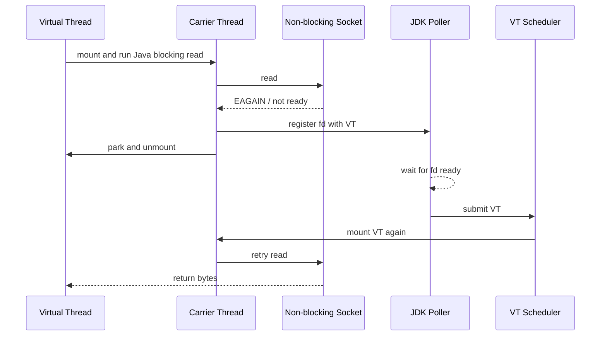

# 虚拟线程

## Servlet

Servlet 是 Java 后端同步编程模型的历史起点之一。Servlet 实际就是运行在 servlet container 中的 Java 类：container 接入 Web
server，负责加载和维护 servlet、session info 和 object store；请求进来后，container 定位对应 servlet，把
`HttpServletRequest` / `HttpServletResponse` 交给它；servlet 在单独线程中执行，并把输出写回客户端。

这套模型后来演化成主流 Java Web 框架的抽象模型：

```text
Client
  -> Web Server / Connector
  -> Servlet Container
  -> Request Thread
  -> Controller / Service / Repository
  -> DB / Redis / RPC / File / MQ
```

### Servlet 模型好在哪里

Servlet / thread-per-request 的优势很直接：

- 业务代码是同步线性的：调用方法、等待返回、继续执行。
- `try/catch/finally`、事务边界、资源释放都和普通 Java 代码一致。
- stack trace 能自然表达业务调用链。
- `ThreadLocal`、MDC、trace context、debugger、profiler 都围绕线程工作。
- JDBC、Servlet、JUC、老 SDK、各种阻塞式 client 都能直接复用。

对业务系统来说，这种可理解性本身就是生产力。一个请求绑定一个线程，线程上的调用栈就是请求的执行历史；发生异常时，栈就是定位路径；需要加事务、日志、鉴权、MDC，也都能围绕当前线程组织。

### Servlet 模型的问题

问题不在同步代码本身，而在平台线程开销很大。平台线程通常对应 OS thread，需要 native stack 和内核调度资源。I/O
密集应用里，请求的大部分时间不是在消耗 CPU，而是在等 DB、Redis、HTTP、文件、消息队列或下游 RPC。

在传统 Servlet 模型中，请求线程等待 I/O 时，OS thread 也一起被占住：

```text
request thread
  -> call JDBC
  -> wait socket
  -> OS thread blocked
  -> cannot serve another request
```

为了提高并发，传统做法是扩大线程池。但几百上千个平台线程会带来几个生产问题：

- 每个线程都有 native stack，内存占用高。
- OS 调度更多线程，context switch 和 cache miss 增加。
- 线程池大小变成容量和延迟之间的关系难预测。
- 下游慢时，大量请求线程堆积，系统容易进入排队放大。
- 共享对象和 session/context attribute 仍然需要应用自己同步访问

这就是 Java 后端长期面对的矛盾：同步模型好写、好调试、生态兼容，但平台线程限制了高并发 I/O 的成本模型。

### Reactive 解决了什么，又带来了什么

Reactive / async 模型解决了线程浪费：把 socket 挂到 selector/event loop 上，I/O ready 后再触发回调。线程不再跟请求一一绑定，少量
event loop 线程可以驱动大量连接。

但代价是控制流被拆散。`Future`、callback、operator、event loop 让代码从“调用一个函数并等待返回”变成“注册后续动作”。这会带来几个
Java 生态里很痛的成本：

- 堆栈信息不再自然表达业务调用链。
- `try/catch/finally`、事务边界、资源释放需要用异步组合重新表达。
- `ThreadLocal`、MDC、trace context 需要额外传播。
- JDBC、Servlet、老 SDK 等同步生态不能直接复用。
- 函数染色明显，调用链会被 `Future`、`Mono`、`suspend` 之类的抽象污染。

Kotlin coroutine 改善了书写体验，但它本质上仍然是编译期 CPS 改写的无栈协程。它可以把异步代码写得像同步代码，却没有完全恢复
JVM 原生线程栈的语义，也仍然有 `suspend` 染色问题。

Loom 的目标就是把这两个世界合起来：保留同步代码、完整栈和 Java 生态兼容性，同时把等待 I/O 时占用平台线程的问题交给 JVM/JDK
runtime 处理。

## 虚拟线程

Virtual Thread 是由 JDK 管理的轻量级线程。API 视角上它仍然是 `java.lang.Thread`，可以用 `Thread.startVirtualThread` 、
`Executors.newVirtualThreadPerTaskExecutor()`、` Thread.ofVirtual().start();` 创建：

```java
try (var executor = Executors.newVirtualThreadPerTaskExecutor()) {
    executor.submit(() -> {
        var body = httpClient.send(request, BodyHandlers.ofString());
        return body.body();
    });
}
```

它和平台线程的差异在实现层：

- 平台线程直接绑定 OS thread。
- 虚拟线程是 Java object，不长期占用某个 OS thread。
- JVM 用少量 carrier thread 执行大量 virtual thread。
- virtual thread 阻塞时可以 unmount，carrier 释放给其它 virtual thread。
- virtual thread 恢复时再 mount 到某个 carrier 上继续执行。

### 阻塞时发生了什么

虚拟线程的核心不是简单的让上下文切换开销更小，而是 JVM 可以在合适的阻塞点把同步执行上下文转成堆中的数据结构。

可以这样理解：

```text
mounted virtual thread
  Java frames run on carrier native stack
  -> encounter blocking operation
  -> freeze / unmount continuation
  -> Java stack frames become heap stack chunks
  -> carrier returns to scheduler
  -> I/O ready / unpark / timeout
  -> scheduler chooses a carrier
  -> thaw / mount continuation
  -> heap stack chunks become executable stack context again
```

Continuation 可以理解为“一段还没执行完的同步控制流”。HotSpot 中 mounted virtual thread 的执行仍然落在 carrier 的 native
stack 上；unmounted virtual thread 的 Java 栈则保存在堆中的 continuation stack chunk 中。

Scheduler 负责把 virtual thread 分配给 carrier。JDK 的 virtual thread scheduler 是 FIFO 模式的 work-stealing
`ForkJoinPool`。它不是 public API，应用不能替换成自己的 scheduler，只能通过 `jdk.virtualThreadScheduler.parallelism` 和
`jdk.virtualThreadScheduler.maxPoolSize` 做有限调参。

### 虚拟线程上的网络 I/O 的运行时路径

一次典型 socket read 可以这样理解：



这个路径解释了为什么虚拟线程对网络 I/O 友好：等待 I/O 的时间不再长期占用 carrier。上层仍是阻塞 API，底层却不再把平台线程一直卡住。它把过去必须手写
event loop、callback 和状态机的工作收进 JDK。

它也解释了后面生产风险的来源：如果 VT 因为 class loading、native frame 或其它 pinning 场景不能 unmount，那么 carrier
仍然会被占住。

### 虚拟线程解决的问题

虚拟线程解决的不是“让代码跑得更快”，而是让 I/O 密集系统能用同步风格承载更多并发。

第一，阻塞式网络 API 可以继续使用。JDK 对大量同步网络 I/O 做了适配：在 virtual thread 中调用 `Socket`、blocking
`SocketChannel` 等 API 时，如果底层 I/O 没有立即 ready，socket 会注册到 JVM 内部 Poller，virtual thread
park/unmount，carrier 被释放。Poller 看到 FD ready 后，再把对应 virtual thread submit 回 scheduler。

第二，JUC 同步原语继续可用。AQS、`LockSupport.park/unpark`、`BlockingQueue`、`Semaphore` 等路径都做了适配。对业务系统来说，这意味着不必把所有同步工具改成
reactive operator。

第三，调试模型更接近普通线程。业务代码仍然有直观的调用栈。但要注意，传统 `jstack` 以平台线程为中心，无法完整看到 unmounted
virtual thread。排查虚拟线程应用时，应该优先使用：

```bash
jcmd <pid> Thread.dump_to_file -format=json <file>
```

第四，虚拟线程不需要池化。平台线程池是为了复用昂贵线程；virtual thread 本身廉价，应该是 task-per-thread。限制下游并发要用
`Semaphore`、连接池、bulkhead 和限流，而不是用固定大小 virtual-thread pool

## 工程落地

虚拟线程适合从应用边界逐步落地，而不是全系统一键替换。

### Web 请求

对于 Spring Boot / Tomcat / Jetty /Undertow 一类同步 Web 栈，理想形态是让每个请求在一个 virtual thread 中执行。这样
controller、service、mapper 仍然是同步代码，JDBC 和 HTTP client 也可以保持阻塞式调用。

Spring Boot 3.2 之后已经提供了较直接的虚拟线程开关。更底层的实现是把 Web 容器的 request executor 换成
virtual-thread-per-task executor。

落地时不应只看 QPS，还要看下游连接池、DB CPU、慢查询、HTTP timeout 和 bulkhead。虚拟线程会降低“线程等待成本”，但不会让数据库或下游服务变快。

### JDBC 与阻塞 SDK

虚拟线程对 JDBC 这类同步 SDK 很有价值。过去 JDBC 调用阻塞平台线程，所以高并发时需要很大的 worker pool；使用 virtual thread
后，等待 socket 的时间通常可以释放 carrier。

但连接池仍然必须存在。连接池控制的是数据库连接这种稀缺资源，不是线程资源。

实践上可以参考的做法：

- request-per-task 用 virtual thread。
- DB connection pool 继续限制连接数。
- 外部 HTTP client 设置 connect/read/request timeout。
- 对慢下游用 semaphore 或 bulkhead 限制同时在途请求。

### 与 Reactive / Netty / Vert.x 共存

虚拟线程不是 Netty event loop 的替代品。Netty/Vert.x/Reactor 的核心逻辑仍然依赖 event loop 线程模型和不能阻塞 event loop
的约束。虚拟线程适合放在边界上，把同步业务逻辑和阻塞 SDK 包起来，而不是在 event loop 内部随意阻塞。

[Reactive ❤️ Loom: A Forbidden Love Story by Francesco Nigro](https://www.youtube.com/watch?v=Oy005l5vHtE) 这场 Devoxx
演讲提供了一个很好的工程视角：在 Quarkus / Vert.x / Netty 这类栈里，event loop 负责 I/O 事件分发，阻塞的 Hibernate/JDBC
业务逻辑过去会被提交到 worker thread pool；启用 Loom 后，替换的通常是这个 worker pool task，让 blocking handler 跑在
virtual thread 上，然后再把响应动作交回 event loop。

这说明 Loom 和 Reactive 不是简单替代关系。virtual thread 让业务代码重新获得同步写法，但 event loop 仍然是网络框架控制
socket、backpressure、channel lifecycle 的边界。对这类系统来说，比较稳的落地方式是：

- 业务服务使用 blocking API + virtual thread。
- 高性能网关、协议层、长连接事件流继续使用 async/event loop。
- 在 Reactive 服务中，只把“必须调用 blocking SDK 的业务段” offload 到 virtual thread，入口和出口仍回到 event loop。

不要期待 virtual thread scheduler 能和 Netty scheduler 深度融合，因为 JDK 并没有公开自定义 virtual thread scheduler。

### 结构化并发与作用域变量

虚拟线程本身解决的是轻量并发单元。多个并发任务之间的生命周期管理，还需要结构化并发；跨调用链的只读上下文传递，则更适合
ScopedValue。它们和 virtual thread 组合，才更接近一套完整的现代 Java 并发模型。

结构化并发适合表达“为一个请求 fork 出多个子任务，任一失败则取消其它任务，退出语法块时保证子任务结束”。这比随手创建多个
future 更容易控制资源生命周期。

按目前的情况看 可能需要到下一个LTS 我们才可能见到正式的
结构化并发，这里暂不过多介绍，如果有需要可以使用 [jox](https://github.com/softwaremill/jox)。

## JDK 21 的生产问题

JDK 21 是 virtual thread 第一个正式 LTS。它能用，但生产上最大风险是 pinning。

Pinning 指 virtual thread 本应 unmount 释放 carrier，但因为 JVM/JDK 边界限制只能把 carrier 一起阻塞。JDK 21 中典型 pinning
来源有两个：`synchronized` 和 native/FFM。

### synchronized / monitor pinning

JDK 21 中 virtual thread 在 `synchronized` 方法或代码块中阻塞时无法释放 carrier。原因是 HotSpot 的 monitor ownership 过去和
platform thread 绑定，如果 VT 在持有 monitor 时换 carrier，会破坏 monitor 语义。

这个问题会在锁内 I/O、锁内 `BlockingQueue.take()`、锁内等待外部系统时放大。最坏情况下，所有 carrier 都被 pinned VT
占住，剩下能解除等待的 virtual thread 反而无法运行。

缓解手段：

- 避免频繁且长时间的锁内阻塞。
- 将这类路径从 `synchronized` 改为 `ReentrantLock`。
- 缩小锁范围，把 I/O 移出锁外。
- 用 JFR `jdk.VirtualThreadPinned` 找热点。
- 避免长期使用 `-Djdk.tracePinnedThreads=full`，它在 JDK 21/22/23 自身也曾触发 hang。

### carrier 不为 pinning 自动补偿

JEP 444 明确指出，scheduler 不会因为 pinning 自动扩展 parallelism。OpenJDK 中 “pinned VT 数量超过 available processors
后死锁” 的典型报告也被关闭为 Not an Issue，因为它属于设计边界。

缓解手段：

- 不要把 `jdk.virtualThreadScheduler.parallelism` 调得很低。
- native、文件 I/O、长阻塞路径使用独立 platform thread executor。
- 控制业务并发用 semaphore / bulkhead，而不是调小 scheduler。

### 早期 stack chunk / GC / thaw 问题

JDK 21 之后修过多个 freeze/thaw、GC 并发扫描、OSR frame 相关问题，例如 stack chunk thawing 和 concurrent GC stack iteration
的 race。这类问题不是业务代码可以规避的。

生产结论：不要停留在早期 JDK 21 GA，至少使用较新的 21u。

### 诊断盲区

JDK 21 的传统 `jstack` 不适合作为 virtual thread 应用的唯一诊断工具。unmounted VT 的栈不在 carrier native stack 上，而在
heap 中的 continuation stack chunk 上。

替代方案：

- 使用 `jcmd <pid> Thread.dump_to_file -format=json <file>`。
- 使用 JFR 观察 pinning、socket read/write、thread park 等事件。
- 对线上 hang 保留自动 dump 和 JFR emergency recording。

## JDK 25 已经改善了什么

JDK 25 是新的 LTS，并且包含了 JDK 24 的 JEP 491，因此它比 JDK 21 更适合把 virtual thread 放进生产主路径。

### synchronized 不再是主要 pinning 来源

JEP 491 改造了 monitor 持有和阻塞路径，让 virtual thread 在进入 monitor、等待 monitor、`Object.wait()` 等常见 synchronized
场景下可以释放 carrier。JDK 21 上“锁内阻塞导致 carrier 被占满”的核心风险，在 JDK 25 中大幅下降。

这并不意味着所有 pinning 消失。native、FFM、class loading、class initialization 等路径仍然需要关注。

## JDK 25 仍要关注的生产问题

JDK 25 的生产风险主要集中在下面几类。

### class loading 和 class initialization

JDK 25 仍可能在 class loading / class initialization 路径 pin carrier。典型场景是多个 virtual thread 同时首次触发同一个类初始化，第一个线程在
`<clinit>` 内等待 I/O、锁或其它 VT，后续线程等待这个类完成初始化。如果 carrier 全被这些等待占住，调度器就可能无法运行真正能解除等待的
VT。

更具体的 NIO 问题是 JDK-8371045：JDK 25 的 Linux 默认或 `-Djdk.pollerMode=2` 下，Poller 可以使用 virtual thread。如果 class
loading 中做 socket I/O，同时所有 carrier 又被等待 class loading 的 VT pin 住，Poller 自己也拿不到 carrier，socket I/O
永远无法完成。

缓解手段：

- 不要在 `<clinit>` / static initializer 中做网络 I/O、DNS、DB 连接、配置中心访问、证书远程加载。
- 对热点类、驱动类、SSL/DB/HTTP client 相关类做启动期预热。
- 如果命中 JDK 25 class loading + socket I/O 风险，测试 `-Djdk.pollerMode=1` 回到 system poller threads。
- JDK 26 的 JDK-8369238 修了部分常见 class initialization 等待路径，但不是 JDK 25 已有能力。

### native / JNI / FFM

Native 方法、FFM 调用、native upcall 回 Java 后阻塞，仍可能 pin carrier。这不是 JDK 25 要完全消除的目标，因为 native code 与
OS thread identity、JNI 状态、回调栈有强绑定。

缓解手段：

- native 阻塞、长时间 JNI、FFM callback 进入 Java 后可能阻塞的路径，用 platform thread executor 隔离。
- JNI critical region 内不要阻塞、不要回调 Java、不要显式 `System.gc()`、不要做可能触发 GC 的大分配。JDK-8375188 说明 JNI
  critical + GC request 仍可能死锁。

### 文件 I/O 和 blocking system call

Socket I/O 被 JDK 深度适配，但文件 I/O 并没有普遍变成真正非阻塞。JEP 444 描述过：某些阻塞操作无法 unmount，只能通过临时扩展
scheduler parallelism 做补偿。补偿不是无限的，也不能替代专门的异步文件 I/O。

缓解手段：

- 大量文件 I/O、压缩、图片处理、上传落盘等路径要独立压测。
- 必要时使用 platform thread executor、AIO、io_uring 封装或专门 worker。
- 不要把文件系统慢操作和核心 request VT 混在同一个无保护路径里。

### 不支持自定义调度器

Virtual thread 的 public API 不允许应用指定 scheduler。JDK 内部 scheduler 是 FIFO 模式的 work-stealing `ForkJoinPool`
，只能通过 `jdk.virtualThreadScheduler.parallelism` 和 `jdk.virtualThreadScheduler.maxPoolSize` 做有限调参。

这在普通同步 Web 服务里通常不是问题，因为目标就是让 JVM 用一个全局 scheduler 承载大量 request-per-task。但在 NIO / event
loop 框架里，它会变成真实的集成边界。Netty/Vert.x 已经有自己的 event loop 线程和任务队列；Loom 又有自己的 carrier
pool。一个请求从 event loop 进入 virtual thread，再从 virtual thread 回到 event loop，会出现额外 handoff。更重要的是，框架不能把
virtual thread continuation 直接安排在自己的 event loop 上执行，也不能把某些 socket continuation 绑定到特定 I/O 线程。

这会给 NIO 场景带来几个限制：

- 不能把 DB socket、HTTP client socket、后台任务恢复 continuation 分到不同 scheduler。
- 不能对 NIO continuation 做优先级/QoS；所有恢复任务都共享同一个调度域。
- 不能靠自定义 scheduler 绕过 carrier 被 pin 住的问题。
- 不能和 Netty/Vert.x event loop 做真正的 scheduler 融合，因此无法直接复用 event loop 的 thread affinity、local
  queue、channel-local 优化和 backpressure 策略。
- 不能把“网络 I/O ready 后恢复 VT”与框架自身的事件循环策略统一调度；在极端低延迟或强资源隔离场景，额外 handoff 和共享
  carrier pool 会成为调优上限。

这也是上面 Devoxx 演讲会讨论 custom scheduler 的原因：如果 virtual thread continuation 能和 Netty event loop 在同一组
platform thread 上交错执行，就可能减少平台线程数量和跨线程提交。但这属于实验性方向，不是 JDK 25 的标准能力，不能作为生产设计前提。

缓解手段：

- 用 semaphore、连接池、限流器、bulkhead 隔离资源。
- 不要把 scheduler 调参当成业务隔离手段。
- 延迟敏感任务和批处理任务要从业务入口上隔离，而不是期待 VT scheduler 做 QoS。
- Netty/Vert.x/Reactor 内部继续遵守 “do not block event loop”；需要 blocking SDK 时，把那一段明确 offload 到 virtual
  thread，再把结果交回 event loop。

### scheduler starvation 和过度调参

JDK-8373224 报告了设置特殊 `jdk.virtualThreadScheduler.parallelism` 后 virtual thread sleep/wakeup starvation
的情况。生产上最危险的是把 parallelism 设得很低，希望“控制并发”，结果反而让 I/O resume、timer、join、park/unpark 的恢复延迟变大。

缓解手段：

- 默认值通常更稳。
- 控制并发用业务级限流，不用调小 scheduler。
- 调参必须压测真实 workload。

## 生产落地 参考方案

JDK 25 上可以把 virtual thread 用在典型 request-per-task、I/O 密集、阻塞风格业务中，例如 HTTP handler、JDBC、Redis、外部
HTTP/RPC 调用。它最适合替代“为了等待 I/O 而堆出几百个平台线程”的模型。

但不要无脑把所有线程池替换为 virtual-thread-per-task。生产落地时可以按下面顺序推进：

1. 升级到最新 JDK 25u，而不是 25 GA 裸版本。
2. 先选 I/O 密集、同步调用链清晰、native 依赖少的服务。
3. Web 请求入口启用 virtual thread，保留下游连接池和 timeout。
4. 禁止 `<clinit>` 做网络 I/O，关键类启动预热。
5. native/JNI/FFM、文件 I/O、CPU heavy 路径保留 platform thread executor。
6. 对 DB、HTTP、Redis、MQ 等外部资源设置连接池上限、timeout、bulkhead。
7. 启用 JFR，关注 `jdk.VirtualThreadPinned`、socket timeout、scheduler 指标。
8. 线程 dump 使用 `jcmd <pid> Thread.dump_to_file -format=json <file>`。
9. 压测中观察 p99/p999 latency，而不是只看平均 QPS。
10. 回滚方案要能切回平台线程 executor 或关闭 virtual thread 开关。

不适合作为第一批迁移对象的路径：

- class initializer 里含 I/O、锁等待、远程配置加载；
- native/JNI/FFM heavy 的 SDK；
- 文件 I/O、压缩、图片处理、CPU heavy 任务；
- Netty/Vert.x/Reactor event loop 内部逻辑；
- 依赖 thread affinity、ThreadLocal 资源池、线程优先级或自定义 scheduler 的代码。

## 生产判断

虚拟线程的价值不是替代所有异步框架，也不是消灭所有线程池，而是让 Java 重新获得一种便宜的 thread-per-task
模型。它最适合业务服务的同步调用链，让代码保留可读性和可调试性，同时减少等待 I/O 时的平台线程浪费。

JDK 21 可以作为理解和小规模使用的起点，但生产主路径要非常关注 synchronized pinning 和早期 21u bug。JDK 25 则更适合作为生产落地点，因为
monitor pinning 的最大问题已经被 JEP 491 处理。但 JDK 25 仍然需要工程约束：不要在 class init 中做 I/O，不要让 native 阻塞污染
carrier，不要靠 scheduler 调参控制业务并发，不要只用传统 `jstack` 排查问题。

## 参考文章

- [50 - Servlets CSC309](https://www.cs.toronto.edu/~penny/teaching/csc309-01f/lectures/50/50servlets.pdf)
- [dreamlike-ocean/blog loom 目录](https://github.com/dreamlike-ocean/blog/tree/master/loom)
- [Reactive ❤️ Loom: A Forbidden Love Story by Francesco Nigro](https://www.youtube.com/watch?v=Oy005l5vHtE)
- [JEP 444: Virtual Threads](https://openjdk.org/jeps/444)
- [JDK-8337395: JEP 491 Synchronize Virtual Threads without Pinning](https://bugs.openjdk.org/browse/JDK-8337395)
- [JDK-8338383: Implement JEP 491](https://bugs.openjdk.org/browse/JDK-8338383)
- [JDK-8371045: Socket I/O during class loading in a virtual thread may cause a deadlock](https://bugs.openjdk.org/browse/JDK-8371045)
- [JDK-8369238: Allow virtual thread preemption on some common class initialization paths](https://bugs.openjdk.org/browse/JDK-8369238)
- [JDK-8373224: VirtualThread starvation when setting special parallelism](https://bugs.openjdk.org/browse/JDK-8373224)
- [JDK-8375188: GC request deadlocks when holding a pinned object](https://bugs.openjdk.org/browse/JDK-8375188)
- [JDK-8322846: Running with jdk.tracePinnedThreads set can hang](https://bugs.openjdk.org/browse/JDK-8322846)
- [JDK-8329088: Stack chunk thawing races with concurrent GC stack iteration](https://bugs.openjdk.org/browse/JDK-8329088)
- [JDK 21 ObjectMonitor owner field](https://github.com/openjdk/jdk/blob/jdk-21%2B35/src/hotspot/share/runtime/objectMonitor.hpp#L163-L164)
- [JDK 21 ObjectMonitor enter owner CAS](https://github.com/openjdk/jdk/blob/jdk-21%2B35/src/hotspot/share/runtime/objectMonitor.cpp#L324-L340)
- [JDK 25 ObjectMonitor owner id field](https://github.com/openjdk/jdk/blob/jdk-25%2B36/src/hotspot/share/runtime/objectMonitor.hpp#L176-L181)
- [JDK 25 ObjectMonitor owner_id_from](https://github.com/openjdk/jdk/blob/jdk-25%2B36/src/hotspot/share/runtime/objectMonitor.inline.hpp#L43-L50)
- [JDK 25 JavaThread monitor_owner_id](https://github.com/openjdk/jdk/blob/jdk-25%2B36/src/hotspot/share/runtime/javaThread.hpp#L166-L179)
- [JDK 25 contended monitor enter preemption](https://github.com/openjdk/jdk/blob/jdk-25%2B36/src/hotspot/share/runtime/objectMonitor.cpp#L526-L569)
- [JDK 25 vthread_monitor_enter](https://github.com/openjdk/jdk/blob/jdk-25%2B36/src/hotspot/share/runtime/objectMonitor.cpp#L1155-L1188)
- [JDK 25 exit_epilog virtual thread wakeup](https://github.com/openjdk/jdk/blob/jdk-25%2B36/src/hotspot/share/runtime/objectMonitor.cpp#L1592-L1633)
- [JDK 25 ObjectWaiter for virtual thread](https://github.com/openjdk/jdk/blob/jdk-25%2B36/src/hotspot/share/runtime/objectMonitor.cpp#L2466-L2480)

